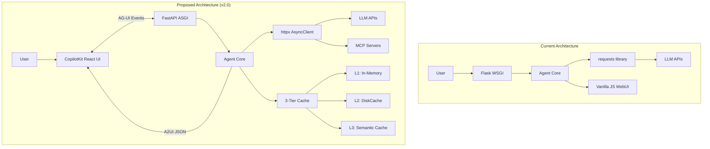
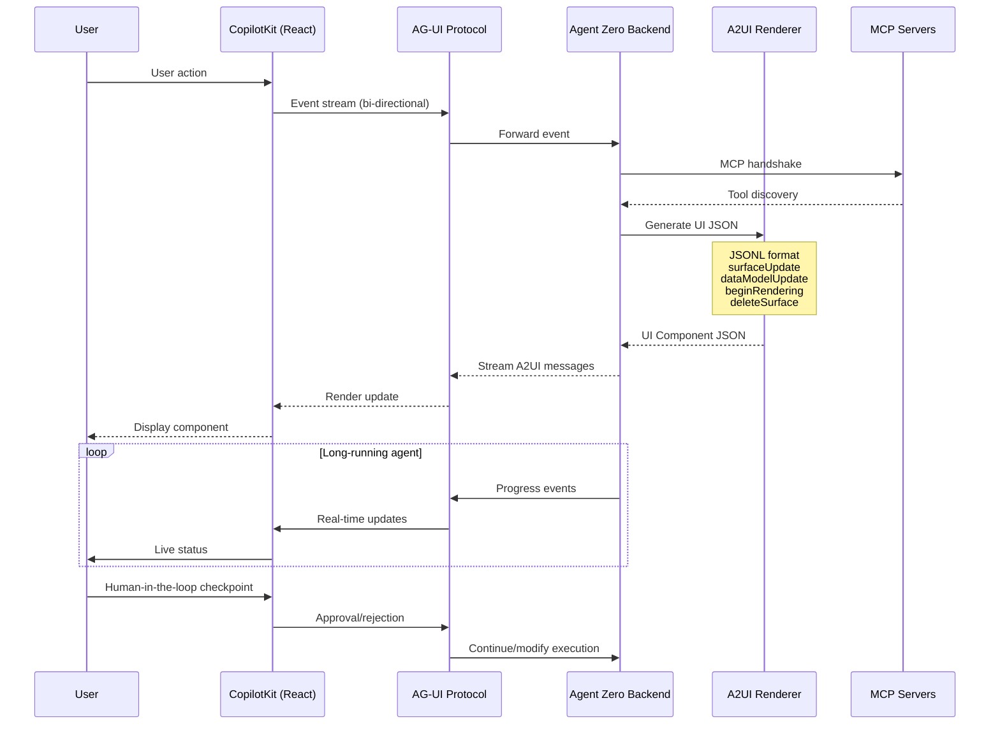
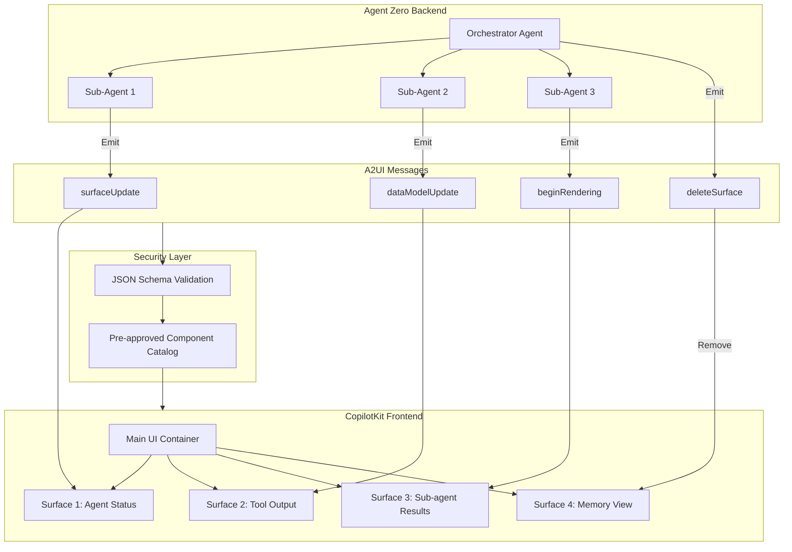
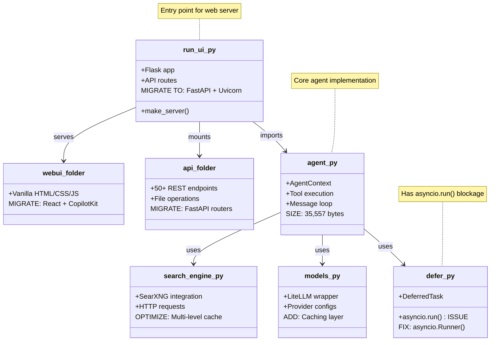
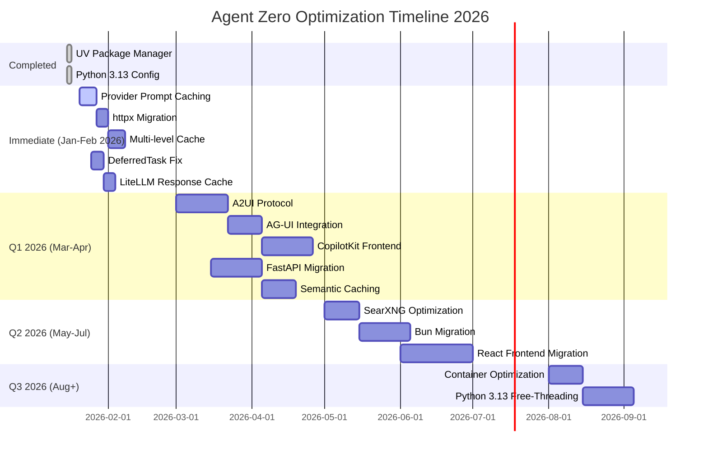

# Agent Zero Optimization Plan v2.0

> **Document Version**: 2.0
> **Created**: 2026-01-18
> **Last Updated**: 2026-01-18
> **Status**: Active

---

## Executive Summary

### Completed Optimizations

| Item | Status | Completion Date |
|------|--------|-----------------|
| UV Package Manager Migration | COMPLETED | 2026-01-16 |
| Python 3.13 Configuration | COMPLETED | 2026-01-16 |
| pyproject.toml Setup | COMPLETED | 2026-01-16 |
| .python-version File | COMPLETED | 2026-01-16 |

### New Priority Items (v2.0)

This version introduces **A2UI + AG-UI + CopilotKit Integration** as a HIGH PRIORITY initiative, enabling:

- Declarative JSON-based UI rendering from agent outputs
- Bi-directional event streaming between frontend and agents
- Multi-agent UI composition with React components
- MCP handshake integration for tool discovery

### Optimization Categories

| Category | Priority | Impact | Status |
|----------|----------|--------|--------|
| A2UI/AG-UI/CopilotKit | P0 (Critical) | Revolutionary UX | NEW |
| LLM Caching (3-tier) | P1 (High) | 70-95% cost reduction | Pending |
| httpx + Connection Pooling | P1 (High) | HTTP/2, reduced latency | Pending |
| Multi-level Cache | P1 (High) | 60-80% API reduction | Pending |
| Flask to FastAPI Migration | P2 (Medium) | Native async, 3-4x throughput | Pending |
| SearXNG Optimization | P2 (Medium) | 2-3x search speed | Pending |
| Bun vs NodeJS | P2 (Medium) | 5-8x cold start | Pending |
| Container Optimization | P3 (Low) | 50% image size | Pending |

---

## Section 1: JSON Task Registry

```json
{
  "version": "2.0",
  "created": "2026-01-18",
  "tasks": [
    {
      "id": "T001",
      "category": "infrastructure",
      "title": "UV Package Manager Migration",
      "priority": "P0",
      "status": "done",
      "complexity": "low",
      "impact": "10-100x faster package operations, unified tooling",
      "dependencies": [],
      "entry_points": ["pyproject.toml", ".python-version"],
      "phase": "immediate",
      "completed_date": "2026-01-16"
    },
    {
      "id": "T002",
      "category": "infrastructure",
      "title": "Python 3.13 Upgrade",
      "priority": "P0",
      "status": "done",
      "complexity": "medium",
      "impact": "5-30% performance improvement, JIT compilation, 7% memory reduction",
      "dependencies": ["T001"],
      "entry_points": [".python-version", "pyproject.toml"],
      "phase": "immediate",
      "completed_date": "2026-01-16"
    },
    {
      "id": "T003",
      "category": "ui-architecture",
      "title": "A2UI Protocol Integration",
      "priority": "P0",
      "status": "pending",
      "complexity": "high",
      "impact": "Declarative JSON UI rendering, security-first component catalog",
      "dependencies": [],
      "entry_points": ["agent.py", "python/api/", "webui/"],
      "phase": "q1",
      "requirements": {
        "message_types": ["surfaceUpdate", "dataModelUpdate", "beginRendering", "deleteSurface"],
        "format": "JSONL streaming"
      }
    },
    {
      "id": "T004",
      "category": "ui-architecture",
      "title": "AG-UI Protocol Integration",
      "priority": "P0",
      "status": "pending",
      "complexity": "high",
      "impact": "Bi-directional event streaming, multi-agent support, MCP handshake",
      "dependencies": ["T003"],
      "entry_points": ["agent.py", "python/api/", "run_ui.py"],
      "phase": "q1",
      "requirements": {
        "features": ["event_streaming", "multi_agent", "long_running_agents", "mcp_handshake"]
      }
    },
    {
      "id": "T005",
      "category": "ui-architecture",
      "title": "CopilotKit Frontend Integration",
      "priority": "P0",
      "status": "pending",
      "complexity": "high",
      "impact": "React hooks, real-time state sync, human-in-the-loop checkpoints",
      "dependencies": ["T003", "T004"],
      "entry_points": ["webui/", "package.json"],
      "phase": "q1",
      "requirements": {
        "framework": "React",
        "hooks": ["useAgent", "useCopilotAction", "useCopilotReadable"]
      }
    },
    {
      "id": "T006",
      "category": "performance",
      "title": "LLM Caching - Provider Prompt Caching",
      "priority": "P1",
      "status": "pending",
      "complexity": "low",
      "impact": "50-90% cost reduction on cached prompts",
      "dependencies": [],
      "entry_points": ["models.py", "prompts/"],
      "phase": "immediate",
      "requirements": {
        "anthropic": "cache_control with 1h TTL",
        "openai": "automatic for 1024+ tokens",
        "openrouter": "automatic routing to warm caches"
      }
    },
    {
      "id": "T007",
      "category": "performance",
      "title": "LLM Caching - Response Caching (LiteLLM)",
      "priority": "P1",
      "status": "pending",
      "complexity": "low",
      "impact": "30-60% additional cost reduction",
      "dependencies": [],
      "entry_points": ["models.py", "conf/model_providers.yaml"],
      "phase": "immediate"
    },
    {
      "id": "T008",
      "category": "performance",
      "title": "LLM Caching - Semantic Caching",
      "priority": "P1",
      "status": "pending",
      "complexity": "medium",
      "impact": "20-40% additional cost reduction via similarity matching",
      "dependencies": ["T007"],
      "entry_points": ["models.py"],
      "phase": "q1"
    },
    {
      "id": "T009",
      "category": "networking",
      "title": "httpx + Connection Pooling",
      "priority": "P1",
      "status": "pending",
      "complexity": "low",
      "impact": "HTTP/2 support, reduced latency, connection reuse",
      "dependencies": [],
      "entry_points": ["python/helpers/", "python/tools/"],
      "phase": "immediate",
      "requirements": {
        "replace": "requests library",
        "with": "httpx AsyncClient",
        "config": {
          "max_keepalive_connections": 20,
          "max_connections": 100,
          "http2": true
        }
      }
    },
    {
      "id": "T010",
      "category": "performance",
      "title": "Multi-level Cache (cachetools L1 + DiskCache L2)",
      "priority": "P1",
      "status": "pending",
      "complexity": "low",
      "impact": "60-80% API call reduction",
      "dependencies": [],
      "entry_points": ["python/helpers/search_engine.py", "python/helpers/memory.py"],
      "phase": "immediate"
    },
    {
      "id": "T011",
      "category": "architecture",
      "title": "Flask to FastAPI Migration",
      "priority": "P2",
      "status": "pending",
      "complexity": "medium",
      "impact": "Native async, 3-4x throughput, automatic OpenAPI docs",
      "dependencies": ["T009"],
      "entry_points": ["run_ui.py", "python/api/"],
      "phase": "q1"
    },
    {
      "id": "T012",
      "category": "performance",
      "title": "SearXNG Optimization",
      "priority": "P2",
      "status": "pending",
      "complexity": "low",
      "impact": "2-3x search speed improvement",
      "dependencies": [],
      "entry_points": ["docker-compose.yml", "searxng/settings.yml"],
      "phase": "q2"
    },
    {
      "id": "T013",
      "category": "infrastructure",
      "title": "Bun Migration (from NodeJS)",
      "priority": "P2",
      "status": "pending",
      "complexity": "medium",
      "impact": "5-8x cold start, 3-4x HTTP throughput, 10-20x package installs",
      "dependencies": [],
      "entry_points": ["package.json", "webui/", "a0-launcher/"],
      "phase": "q2"
    },
    {
      "id": "T014",
      "category": "infrastructure",
      "title": "Container Optimization (Multi-stage builds)",
      "priority": "P3",
      "status": "pending",
      "complexity": "medium",
      "impact": "50% image size reduction, faster deployments",
      "dependencies": [],
      "entry_points": ["Dockerfile", "DockerfileLocal"],
      "phase": "q3"
    },
    {
      "id": "T015",
      "category": "architecture",
      "title": "DeferredTask asyncio.run() Fix",
      "priority": "P1",
      "status": "pending",
      "complexity": "medium",
      "impact": "Eliminate event loop blocking, enable proper async flow",
      "dependencies": [],
      "entry_points": ["python/helpers/defer.py"],
      "phase": "immediate",
      "requirements": {
        "replace": "asyncio.run() in sync context",
        "with": "asyncio.Runner() for reusable event loop"
      }
    }
  ]
}
```

---

## Section 2: Architecture Diagrams

### 2.1 Current vs Proposed Architecture



### 2.2 A2UI/AG-UI Data Flow



### 2.3 Multi-Agent UI Composition



### 2.4 Entry Points and Dependencies



### 2.5 Implementation Timeline (Gantt)



---

## Section 3: Implementation Details

### 3.1 A2UI Protocol Integration

#### Current State
- Agent Zero uses vanilla JS WebUI with server-sent events
- No structured UI component protocol
- Limited dynamic UI capabilities

#### Target State
- Declarative JSON format for UI rendering
- Security-first pre-approved component catalog
- JSONL streaming for real-time updates

#### Step-by-Step Actions

1. **Define A2UI Message Types**

```python
# python/a2ui/messages.py
from dataclasses import dataclass
from typing import Literal, Any
import json

@dataclass
class A2UIMessage:
    type: Literal["surfaceUpdate", "dataModelUpdate", "beginRendering", "deleteSurface"]
    surface_id: str
    payload: dict

    def to_jsonl(self) -> str:
        return json.dumps({
            "type": self.type,
            "surfaceId": self.surface_id,
            "payload": self.payload
        }) + "\n"

@dataclass
class SurfaceUpdate(A2UIMessage):
    """Update an existing surface with new content"""
    type: Literal["surfaceUpdate"] = "surfaceUpdate"

    @classmethod
    def create(cls, surface_id: str, component: str, props: dict):
        return cls(
            type="surfaceUpdate",
            surface_id=surface_id,
            payload={"component": component, "props": props}
        )

@dataclass
class DataModelUpdate(A2UIMessage):
    """Update the data model without re-rendering"""
    type: Literal["dataModelUpdate"] = "dataModelUpdate"

@dataclass
class BeginRendering(A2UIMessage):
    """Signal the start of a new surface rendering"""
    type: Literal["beginRendering"] = "beginRendering"

@dataclass
class DeleteSurface(A2UIMessage):
    """Remove a surface from the UI"""
    type: Literal["deleteSurface"] = "deleteSurface"
```

2. **Create Component Catalog**

```python
# python/a2ui/catalog.py
APPROVED_COMPONENTS = {
    "AgentStatus": {
        "props": ["status", "message", "progress"],
        "schema": {
            "status": {"type": "string", "enum": ["idle", "running", "complete", "error"]},
            "message": {"type": "string"},
            "progress": {"type": "number", "min": 0, "max": 100}
        }
    },
    "ToolOutput": {
        "props": ["tool_name", "result", "execution_time"],
        "schema": {
            "tool_name": {"type": "string"},
            "result": {"type": "object"},
            "execution_time": {"type": "number"}
        }
    },
    "CodeBlock": {
        "props": ["language", "code", "filename"],
        "schema": {
            "language": {"type": "string"},
            "code": {"type": "string"},
            "filename": {"type": "string", "optional": True}
        }
    },
    "MemoryView": {
        "props": ["memories", "total_count"],
        "schema": {
            "memories": {"type": "array"},
            "total_count": {"type": "integer"}
        }
    },
    "SubAgentProgress": {
        "props": ["agent_id", "task", "status", "result"],
        "schema": {
            "agent_id": {"type": "string"},
            "task": {"type": "string"},
            "status": {"type": "string"},
            "result": {"type": "object", "optional": True}
        }
    }
}

def validate_component(component: str, props: dict) -> bool:
    """Validate component against approved catalog"""
    if component not in APPROVED_COMPONENTS:
        return False

    spec = APPROVED_COMPONENTS[component]
    for prop_name, prop_schema in spec["schema"].items():
        if prop_name not in props and not prop_schema.get("optional"):
            return False

    return True
```

3. **Integrate with Agent Core**

```python
# python/a2ui/emitter.py
from typing import AsyncIterator
import asyncio

class A2UIEmitter:
    def __init__(self, agent_context):
        self.context = agent_context
        self.surfaces: dict[str, A2UIMessage] = {}

    async def emit(self, message: A2UIMessage) -> None:
        """Emit A2UI message to connected clients"""
        if not validate_component(message.payload.get("component", ""),
                                   message.payload.get("props", {})):
            raise ValueError(f"Component not in approved catalog")

        self.surfaces[message.surface_id] = message
        await self.context.broadcast(message.to_jsonl())

    async def stream_updates(self) -> AsyncIterator[str]:
        """Stream A2UI messages as JSONL"""
        queue = asyncio.Queue()
        self.context.add_listener(queue)

        try:
            while True:
                message = await queue.get()
                yield message
        finally:
            self.context.remove_listener(queue)
```

#### Success Metrics
- All agent outputs rendered via A2UI components
- Zero non-cataloged components in production
- Sub-100ms surface update latency

---

### 3.2 AG-UI Protocol Integration

#### Current State
- One-way communication (server to client)
- No structured event protocol
- Limited multi-agent UI support

#### Target State
- Bi-directional event streaming
- Multi-agent support with parallel updates
- Long-running agent support with checkpoints
- MCP handshake integration

#### Step-by-Step Actions

1. **Define AG-UI Event Protocol**

```python
# python/agui/protocol.py
from dataclasses import dataclass
from typing import Literal, Optional
from enum import Enum

class AGUIEventType(Enum):
    # Client to Server
    USER_INPUT = "user_input"
    CHECKPOINT_RESPONSE = "checkpoint_response"
    CANCEL_REQUEST = "cancel_request"

    # Server to Client
    AGENT_STARTED = "agent_started"
    AGENT_PROGRESS = "agent_progress"
    AGENT_COMPLETE = "agent_complete"
    AGENT_ERROR = "agent_error"
    CHECKPOINT_REQUEST = "checkpoint_request"
    TOOL_CALL = "tool_call"
    TOOL_RESULT = "tool_result"
    MCP_HANDSHAKE = "mcp_handshake"

@dataclass
class AGUIEvent:
    event_type: AGUIEventType
    agent_id: str
    session_id: str
    payload: dict
    timestamp: float
    sequence_id: int

    def to_sse(self) -> str:
        """Format as Server-Sent Event"""
        return f"event: {self.event_type.value}\ndata: {json.dumps(self.payload)}\n\n"

@dataclass
class CheckpointRequest:
    """Human-in-the-loop checkpoint"""
    checkpoint_id: str
    agent_id: str
    question: str
    options: list[str]
    timeout_seconds: Optional[int] = 300

    def to_event(self) -> AGUIEvent:
        return AGUIEvent(
            event_type=AGUIEventType.CHECKPOINT_REQUEST,
            agent_id=self.agent_id,
            session_id="",
            payload={
                "checkpoint_id": self.checkpoint_id,
                "question": self.question,
                "options": self.options,
                "timeout": self.timeout_seconds
            },
            timestamp=time.time(),
            sequence_id=0
        )
```

2. **Implement Bi-directional Streaming**

```python
# python/agui/stream.py
from fastapi import WebSocket
import asyncio

class AGUIStream:
    def __init__(self, websocket: WebSocket):
        self.ws = websocket
        self.sequence = 0
        self.pending_checkpoints: dict[str, asyncio.Future] = {}

    async def send_event(self, event: AGUIEvent) -> None:
        """Send event to client"""
        event.sequence_id = self.sequence
        self.sequence += 1
        await self.ws.send_text(event.to_sse())

    async def receive_event(self) -> AGUIEvent:
        """Receive event from client"""
        data = await self.ws.receive_json()
        return AGUIEvent(**data)

    async def request_checkpoint(self, request: CheckpointRequest) -> str:
        """Request human-in-the-loop checkpoint, wait for response"""
        future = asyncio.Future()
        self.pending_checkpoints[request.checkpoint_id] = future

        await self.send_event(request.to_event())

        try:
            response = await asyncio.wait_for(future, timeout=request.timeout_seconds)
            return response
        except asyncio.TimeoutError:
            return "timeout"
        finally:
            del self.pending_checkpoints[request.checkpoint_id]

    async def handle_checkpoint_response(self, checkpoint_id: str, response: str) -> None:
        """Handle checkpoint response from client"""
        if checkpoint_id in self.pending_checkpoints:
            self.pending_checkpoints[checkpoint_id].set_result(response)
```

3. **MCP Handshake Integration**

```python
# python/agui/mcp_handshake.py
from python.tools.mcp import MCPClient

class MCPHandshake:
    def __init__(self, agui_stream: AGUIStream):
        self.stream = agui_stream
        self.discovered_tools: dict[str, dict] = {}

    async def perform_handshake(self, mcp_servers: list[str]) -> dict:
        """Perform MCP handshake and report to client"""
        for server_url in mcp_servers:
            client = MCPClient(server_url)
            tools = await client.discover_tools()
            self.discovered_tools[server_url] = tools

            await self.stream.send_event(AGUIEvent(
                event_type=AGUIEventType.MCP_HANDSHAKE,
                agent_id="system",
                session_id="",
                payload={
                    "server": server_url,
                    "tools": [t.name for t in tools],
                    "status": "connected"
                },
                timestamp=time.time(),
                sequence_id=0
            ))

        return self.discovered_tools
```

#### Success Metrics
- Bi-directional event latency < 50ms
- Checkpoint response rate > 95%
- Zero dropped events in long-running sessions

---

### 3.3 CopilotKit Frontend Integration

#### Current State
- Vanilla HTML/CSS/JS frontend
- jQuery-style DOM manipulation
- No React component system

#### Target State
- React-based frontend with CopilotKit
- useAgent hooks for agent interaction
- Real-time state synchronization
- Human-in-the-loop UI components

#### Step-by-Step Actions

1. **Setup React + CopilotKit Project**

```bash
# Initialize new frontend project
cd webui
bunx create-react-app . --template typescript
bun add @copilotkit/react-core @copilotkit/react-ui
bun add @copilotkit/runtime @copilotkit/sdk
```

2. **Create Agent Zero Provider**

```typescript
// webui/src/providers/AgentZeroProvider.tsx
import { CopilotKit } from "@copilotkit/react-core";
import { CopilotSidebar } from "@copilotkit/react-ui";

interface AgentZeroProviderProps {
  children: React.ReactNode;
  backendUrl: string;
}

export function AgentZeroProvider({ children, backendUrl }: AgentZeroProviderProps) {
  return (
    <CopilotKit
      runtimeUrl={`${backendUrl}/api/copilotkit`}
      agent="agent-zero"
    >
      {children}
      <CopilotSidebar
        labels={{
          title: "Agent Zero",
          initial: "How can I help you today?"
        }}
      />
    </CopilotKit>
  );
}
```

3. **Implement useAgent Hook**

```typescript
// webui/src/hooks/useAgentZero.ts
import { useCoAgent, useCopilotAction } from "@copilotkit/react-core";
import { useState, useCallback } from "react";

interface AgentState {
  status: "idle" | "running" | "complete" | "error";
  currentTask: string | null;
  subAgents: SubAgentState[];
  surfaces: Map<string, A2UISurface>;
}

interface SubAgentState {
  id: string;
  task: string;
  status: string;
  result?: unknown;
}

interface A2UISurface {
  id: string;
  component: string;
  props: Record<string, unknown>;
}

export function useAgentZero() {
  const [state, setState] = useState<AgentState>({
    status: "idle",
    currentTask: null,
    subAgents: [],
    surfaces: new Map()
  });

  // Handle A2UI surface updates
  const handleSurfaceUpdate = useCallback((message: A2UIMessage) => {
    setState(prev => {
      const newSurfaces = new Map(prev.surfaces);

      switch (message.type) {
        case "surfaceUpdate":
        case "beginRendering":
          newSurfaces.set(message.surfaceId, {
            id: message.surfaceId,
            component: message.payload.component,
            props: message.payload.props
          });
          break;
        case "deleteSurface":
          newSurfaces.delete(message.surfaceId);
          break;
      }

      return { ...prev, surfaces: newSurfaces };
    });
  }, []);

  // Register CopilotKit actions
  useCopilotAction({
    name: "executeTask",
    description: "Execute a task with Agent Zero",
    parameters: [
      { name: "task", type: "string", description: "The task to execute" }
    ],
    handler: async ({ task }) => {
      setState(prev => ({ ...prev, status: "running", currentTask: task }));
      // Task execution handled by AG-UI protocol
    }
  });

  // Agent state from CopilotKit
  const { state: agentState, start, stop } = useCoAgent({
    name: "agent-zero",
    initialState: { messages: [] }
  });

  return {
    state,
    agentState,
    start,
    stop,
    surfaces: Array.from(state.surfaces.values())
  };
}
```

4. **Create A2UI Surface Renderer**

```typescript
// webui/src/components/A2UISurfaceRenderer.tsx
import React from "react";
import { AgentStatus } from "./surfaces/AgentStatus";
import { ToolOutput } from "./surfaces/ToolOutput";
import { CodeBlock } from "./surfaces/CodeBlock";
import { MemoryView } from "./surfaces/MemoryView";
import { SubAgentProgress } from "./surfaces/SubAgentProgress";

// Pre-approved component catalog (mirrors backend)
const COMPONENT_CATALOG: Record<string, React.ComponentType<any>> = {
  AgentStatus,
  ToolOutput,
  CodeBlock,
  MemoryView,
  SubAgentProgress
};

interface A2UISurface {
  id: string;
  component: string;
  props: Record<string, unknown>;
}

interface Props {
  surface: A2UISurface;
}

export function A2UISurfaceRenderer({ surface }: Props) {
  const Component = COMPONENT_CATALOG[surface.component];

  if (!Component) {
    console.error(`Unknown component: ${surface.component}`);
    return (
      <div className="a2ui-error">
        Unknown component: {surface.component}
      </div>
    );
  }

  return (
    <div className="a2ui-surface" data-surface-id={surface.id}>
      <Component {...surface.props} />
    </div>
  );
}
```

5. **Implement Human-in-the-Loop Checkpoints**

```typescript
// webui/src/components/CheckpointDialog.tsx
import { useCopilotAction } from "@copilotkit/react-core";
import { useState, useEffect } from "react";

interface CheckpointRequest {
  checkpointId: string;
  question: string;
  options: string[];
  timeout: number;
}

export function CheckpointDialog() {
  const [checkpoint, setCheckpoint] = useState<CheckpointRequest | null>(null);
  const [timeRemaining, setTimeRemaining] = useState(0);

  // Listen for checkpoint requests from AG-UI
  useCopilotAction({
    name: "checkpoint",
    description: "Human-in-the-loop checkpoint",
    parameters: [
      { name: "checkpointId", type: "string" },
      { name: "question", type: "string" },
      { name: "options", type: "array" }
    ],
    handler: async ({ checkpointId, question, options }) => {
      setCheckpoint({ checkpointId, question, options, timeout: 300 });
      setTimeRemaining(300);
    }
  });

  // Countdown timer
  useEffect(() => {
    if (!checkpoint) return;

    const timer = setInterval(() => {
      setTimeRemaining(prev => {
        if (prev <= 1) {
          handleResponse("timeout");
          return 0;
        }
        return prev - 1;
      });
    }, 1000);

    return () => clearInterval(timer);
  }, [checkpoint]);

  const handleResponse = async (response: string) => {
    if (!checkpoint) return;

    // Send response via AG-UI protocol
    await fetch("/api/agui/checkpoint-response", {
      method: "POST",
      headers: { "Content-Type": "application/json" },
      body: JSON.stringify({
        checkpointId: checkpoint.checkpointId,
        response
      })
    });

    setCheckpoint(null);
  };

  if (!checkpoint) return null;

  return (
    <div className="checkpoint-dialog">
      <h3>Agent Zero needs your input</h3>
      <p>{checkpoint.question}</p>
      <div className="checkpoint-timer">
        Time remaining: {Math.floor(timeRemaining / 60)}:{(timeRemaining % 60).toString().padStart(2, '0')}
      </div>
      <div className="checkpoint-options">
        {checkpoint.options.map(option => (
          <button
            key={option}
            onClick={() => handleResponse(option)}
          >
            {option}
          </button>
        ))}
      </div>
    </div>
  );
}
```

#### Success Metrics
- Frontend bundle size < 500KB gzipped
- Time to interactive < 2 seconds
- Component render time < 16ms (60fps)

---

### 3.4 LLM Caching Implementation (3-Tier)

#### Current State
- No caching implementation
- Every LLM call hits the API
- High costs for repeated queries

#### Target State
- Tier 1: Provider Prompt Caching (90% cost reduction)
- Tier 2: LiteLLM Response Caching (30-60% additional)
- Tier 3: Semantic Caching (20-40% additional)
- Combined: 70-95% cost reduction

#### Step-by-Step Actions

1. **Enable Provider Prompt Caching**

```python
# python/helpers/prompt_cache.py

def add_cache_control_to_messages(messages: list[dict], model: str) -> list[dict]:
    """Add cache_control to system prompts for supported providers"""

    if "claude" in model.lower() or "anthropic" in model.lower():
        # Anthropic cache control
        for msg in messages:
            if msg["role"] == "system":
                if isinstance(msg["content"], str):
                    msg["content"] = [{
                        "type": "text",
                        "text": msg["content"],
                        "cache_control": {"type": "ephemeral", "ttl": "1h"}
                    }]
                elif isinstance(msg["content"], list):
                    for content in msg["content"]:
                        if content.get("type") == "text":
                            content["cache_control"] = {"type": "ephemeral", "ttl": "1h"}

    return messages
```

2. **Configure LiteLLM Response Caching**

```yaml
# conf/litellm_cache.yaml
litellm_settings:
  cache: True
  cache_params:
    type: "redis"
    host: "localhost"
    port: 6379
    ttl: 600
    namespace: "agent_zero"

    # In-memory cache for fast hits (LiteLLM v1.75.5+)
    in_memory_cache_ttl: 60
```

```python
# python/helpers/llm_cache.py
import litellm
from litellm import Cache
import os

def setup_litellm_cache():
    """Initialize LiteLLM caching"""

    # Check for Redis availability
    redis_host = os.environ.get("REDIS_HOST", "localhost")
    redis_port = int(os.environ.get("REDIS_PORT", 6379))

    try:
        import redis
        r = redis.Redis(host=redis_host, port=redis_port)
        r.ping()

        # Use Redis if available
        litellm.cache = Cache(
            type="redis",
            host=redis_host,
            port=redis_port,
            ttl=600
        )
        print("LiteLLM cache: Redis enabled")

    except Exception:
        # Fall back to in-memory cache
        litellm.cache = Cache(type="local")
        print("LiteLLM cache: In-memory enabled")

def completion_with_cache(**kwargs):
    """Wrapper for litellm.completion with cache control"""

    # Add cache control for prompts
    if "messages" in kwargs:
        kwargs["messages"] = add_cache_control_to_messages(
            kwargs["messages"],
            kwargs.get("model", "")
        )

    # Set cache TTL based on message type
    if kwargs.get("stream"):
        kwargs["cache"] = {"ttl": 60}  # Shorter TTL for streaming
    else:
        kwargs["cache"] = {"ttl": 600}  # Longer for complete responses

    return litellm.completion(**kwargs)
```

3. **Implement Semantic Caching**

```python
# python/helpers/semantic_cache.py
import hashlib
from typing import Optional
import numpy as np

class SemanticCache:
    def __init__(self, embedding_model: str = "text-embedding-3-small"):
        self.embedding_model = embedding_model
        self.cache: dict[str, tuple[np.ndarray, str]] = {}
        self.similarity_threshold = 0.85

    def _get_embedding(self, text: str) -> np.ndarray:
        """Get embedding for text"""
        import litellm
        response = litellm.embedding(
            model=self.embedding_model,
            input=[text]
        )
        return np.array(response.data[0].embedding)

    def _cosine_similarity(self, a: np.ndarray, b: np.ndarray) -> float:
        """Calculate cosine similarity between two vectors"""
        return np.dot(a, b) / (np.linalg.norm(a) * np.linalg.norm(b))

    def get(self, query: str) -> Optional[str]:
        """Get cached response for similar query"""
        query_embedding = self._get_embedding(query)

        best_match = None
        best_similarity = 0.0

        for key, (embedding, response) in self.cache.items():
            similarity = self._cosine_similarity(query_embedding, embedding)
            if similarity > best_similarity and similarity >= self.similarity_threshold:
                best_similarity = similarity
                best_match = response

        return best_match

    def set(self, query: str, response: str) -> None:
        """Cache response with embedding"""
        embedding = self._get_embedding(query)
        cache_key = hashlib.md5(query.encode()).hexdigest()
        self.cache[cache_key] = (embedding, response)

# Global instance
semantic_cache = SemanticCache()
```

#### Success Metrics
- Cache hit rate > 60%
- Average response latency reduction > 50%
- Monthly LLM cost reduction > 70%

---

### 3.5 httpx + Connection Pooling

#### Current State
- Uses `requests` library (blocking)
- No connection pooling
- No HTTP/2 support

#### Target State
- httpx AsyncClient with connection pooling
- HTTP/2 enabled for all connections
- Reduced latency and resource usage

#### Step-by-Step Actions

1. **Create Global HTTP Client**

```python
# python/helpers/http_client.py
import httpx
from contextlib import asynccontextmanager
from typing import Optional

class HTTPClientManager:
    _instance: Optional["HTTPClientManager"] = None
    _client: Optional[httpx.AsyncClient] = None

    def __new__(cls):
        if cls._instance is None:
            cls._instance = super().__new__(cls)
        return cls._instance

    async def get_client(self) -> httpx.AsyncClient:
        if self._client is None or self._client.is_closed:
            self._client = httpx.AsyncClient(
                limits=httpx.Limits(
                    max_keepalive_connections=20,
                    max_connections=100,
                    keepalive_expiry=30.0
                ),
                http2=True,
                timeout=httpx.Timeout(30.0, connect=5.0),
                follow_redirects=True
            )
        return self._client

    async def close(self):
        if self._client:
            await self._client.aclose()
            self._client = None

# Global singleton
http_manager = HTTPClientManager()

async def get_http_client() -> httpx.AsyncClient:
    return await http_manager.get_client()
```

2. **Migration Guide for requests to httpx**

```python
# Before (python/helpers/old_code.py)
import requests

def fetch_data(url: str) -> dict:
    response = requests.get(url, timeout=30)
    response.raise_for_status()
    return response.json()

# After (python/helpers/new_code.py)
from python.helpers.http_client import get_http_client

async def fetch_data(url: str) -> dict:
    client = await get_http_client()
    response = await client.get(url)
    response.raise_for_status()
    return response.json()

# Sync fallback (for gradual migration)
def fetch_data_sync(url: str) -> dict:
    with httpx.Client(http2=True) as client:
        response = client.get(url, timeout=30)
        response.raise_for_status()
        return response.json()
```

3. **Files to Migrate**

```python
# Priority files for httpx migration:
MIGRATION_FILES = [
    "python/helpers/search_engine.py",     # SearXNG calls
    "python/tools/browser_agent.py",       # Web fetching
    "python/tools/code_execution.py",      # Remote execution
    "python/helpers/duckduckgo_search.py", # DuckDuckGo API
    "python/api/*.py",                     # All API files
]
```

#### Success Metrics
- Average request latency reduction > 30%
- Connection reuse rate > 80%
- HTTP/2 usage rate > 90%

---

### 3.6 Multi-level Cache (cachetools + DiskCache)

#### Current State
- No caching for search results
- No caching for memory queries
- Repeated API calls for same data

#### Target State
- L1: In-memory cache (sub-1ms access)
- L2: Disk cache (1-10ms access)
- 60-80% reduction in API calls

#### Step-by-Step Actions

1. **Implement Two-Level Cache**

```python
# python/helpers/multi_cache.py
from cachetools import TTLCache, LRUCache
from diskcache import Cache
from typing import Optional, Any, Callable
import hashlib
import json
import os

class MultiLevelCache:
    def __init__(
        self,
        name: str,
        l1_maxsize: int = 1000,
        l1_ttl: int = 300,
        l2_directory: str = "/tmp/agent_zero_cache",
        l2_ttl: int = 3600
    ):
        self.name = name

        # L1: In-memory cache (fast, limited size)
        self.l1 = TTLCache(maxsize=l1_maxsize, ttl=l1_ttl)

        # L2: Disk cache (slower, larger capacity)
        self.l2 = Cache(
            directory=os.path.join(l2_directory, name),
            size_limit=1024 * 1024 * 100  # 100MB
        )
        self.l2_ttl = l2_ttl

    def _make_key(self, *args, **kwargs) -> str:
        """Generate cache key from arguments"""
        key_data = json.dumps({"args": args, "kwargs": kwargs}, sort_keys=True)
        return hashlib.md5(key_data.encode()).hexdigest()

    def get(self, key: str) -> Optional[Any]:
        """Get from cache, checking L1 then L2"""
        # Check L1 first
        if key in self.l1:
            return self.l1[key]

        # Check L2
        if key in self.l2:
            value = self.l2[key]
            # Promote to L1
            self.l1[key] = value
            return value

        return None

    def set(self, key: str, value: Any) -> None:
        """Set in both cache levels"""
        self.l1[key] = value
        self.l2.set(key, value, expire=self.l2_ttl)

    def cached(self, func: Callable) -> Callable:
        """Decorator for caching function results"""
        import functools

        @functools.wraps(func)
        async def async_wrapper(*args, **kwargs):
            key = self._make_key(*args, **kwargs)

            cached = self.get(key)
            if cached is not None:
                return cached

            result = await func(*args, **kwargs)
            self.set(key, result)
            return result

        @functools.wraps(func)
        def sync_wrapper(*args, **kwargs):
            key = self._make_key(*args, **kwargs)

            cached = self.get(key)
            if cached is not None:
                return cached

            result = func(*args, **kwargs)
            self.set(key, result)
            return result

        import asyncio
        if asyncio.iscoroutinefunction(func):
            return async_wrapper
        return sync_wrapper

# Pre-configured caches for different use cases
search_cache = MultiLevelCache("search", l1_maxsize=500, l1_ttl=180)
memory_cache = MultiLevelCache("memory", l1_maxsize=1000, l1_ttl=600)
embedding_cache = MultiLevelCache("embeddings", l1_maxsize=2000, l1_ttl=3600)
```

2. **Apply to Search Engine**

```python
# python/helpers/search_engine.py
from python.helpers.multi_cache import search_cache

class SearchEngine:
    @search_cache.cached
    async def search(self, query: str, num_results: int = 10) -> list[dict]:
        """Cached search query"""
        # Original search implementation
        ...
```

#### Success Metrics
- L1 cache hit rate > 40%
- L2 cache hit rate > 30%
- Overall API call reduction > 60%

---

## Section 4: Risk Assessment

### Technical Risks

| Risk | Probability | Impact | Mitigation |
|------|-------------|--------|------------|
| A2UI/AG-UI protocol immaturity | Medium | High | Implement fallback to SSE; version protocol; maintain backward compatibility |
| CopilotKit breaking changes | Medium | Medium | Pin versions; maintain vanilla JS fallback; monitor changelog |
| FastAPI migration complexity | Low | High | Gradual migration; use ASGI middleware; comprehensive testing |
| Cache invalidation issues | Medium | Medium | Conservative TTLs; manual invalidation endpoints; monitoring |
| httpx async migration | Low | Medium | Provide sync fallbacks; parallel codepaths during transition |

### Dependency Risks

| Dependency | Risk | Mitigation |
|------------|------|------------|
| CopilotKit | New framework, limited track record | Abstract interface; prepare fallback |
| Bun | Anthropic acquisition changes direction | Keep Node.js as fallback |
| Python 3.13 Free-threading | Experimental | Optional, behind feature flag |
| Redis for caching | Requires infrastructure | In-memory + DiskCache fallback |

### Migration Risks

| Migration | Risk Level | Rollback Strategy |
|-----------|------------|-------------------|
| Flask to FastAPI | Medium | Keep Flask endpoints alongside; feature flag |
| Vanilla JS to React | High | Parallel deployments; A/B testing |
| requests to httpx | Low | Sync fallback available |
| npm to Bun | Low | package-lock.json preserved |

---

## Section 5: Success Metrics Summary

### Performance Metrics

| Metric | Current | Target | Measurement Method |
|--------|---------|--------|-------------------|
| LLM API Cost | Baseline | -70% | Provider billing dashboard |
| Average Response Latency | ~2000ms | ~800ms | Application metrics |
| HTTP Request Latency | ~150ms | ~50ms | httpx instrumentation |
| Cache Hit Rate | 0% | >60% | Cache statistics endpoint |
| Search Speed | Baseline | 2-3x faster | SearXNG /stats endpoint |
| Cold Start Time | ~42ms | ~8ms | Container startup monitoring |
| Docker Image Size | ~523MB | ~273MB | `docker images` output |

### User Experience Metrics

| Metric | Current | Target | Measurement Method |
|--------|---------|--------|-------------------|
| Time to First Token | ~1500ms | ~500ms | Frontend instrumentation |
| UI Update Latency | ~500ms | ~50ms | A2UI event timestamps |
| Human-in-the-loop Response | N/A | >95% | Checkpoint completion rate |
| Frontend Bundle Size | N/A | <500KB | Webpack bundle analyzer |

### Developer Experience Metrics

| Metric | Current | Target | Measurement Method |
|--------|---------|--------|-------------------|
| Package Install Time | ~60s | ~3s | CI/CD logs |
| Test Execution Time | Baseline | 5-10x faster | Test runner output |
| Type Check Coverage | Partial | >90% | pyrefly/ty reports |

---

## Appendix A: Entry Points Reference

| File | Size | Purpose | Optimization Target |
|------|------|---------|---------------------|
| `run_ui.py` | ~8KB | Flask web server | FastAPI migration |
| `agent.py` | 35,557 bytes | Core agent implementation | A2UI emission |
| `models.py` | ~15KB | LiteLLM wrapper | Caching integration |
| `python/helpers/defer.py` | ~3KB | DeferredTask | asyncio.Runner fix |
| `python/helpers/search_engine.py` | ~5KB | SearXNG integration | Multi-level cache |
| `python/api/*.py` | ~50 files | REST API endpoints | FastAPI routers |
| `webui/` | ~100 files | Frontend assets | React + CopilotKit |

---

## Appendix B: Command Reference

```bash
# Development environment
uv sync                          # Sync dependencies
uv run python run_ui.py          # Start development server

# Code quality
uv run ruff check . --fix        # Lint and fix
uv run ruff format .             # Format code
uv run pyrefly check .           # Type checking (Meta)
uv run ty check .                # Type checking (alternative)

# Testing
uv run pytest tests/             # Run tests

# Docker
docker build -f DockerfileLocal -t agent-zero-local .
docker run -p 50001:80 agent-zero-local

# Frontend (after migration)
bun install                      # Install dependencies
bun run dev                      # Development server
bun run build                    # Production build
bun test                         # Run tests
```

---

## Appendix C: Configuration Templates

### LiteLLM Caching Configuration

```yaml
# conf/litellm_cache.yaml
litellm_settings:
  cache: True
  cache_params:
    type: redis
    host: ${REDIS_HOST:-localhost}
    port: ${REDIS_PORT:-6379}
    ttl: 600
    namespace: agent_zero
```

### FastAPI Server Configuration

```python
# conf/uvicorn_config.py
config = {
    "host": "0.0.0.0",
    "port": 5000,
    "workers": 4,
    "limit_concurrency": 1000,
    "limit_max_requests": 10000,
    "timeout_keep_alive": 30,
    "access_log": True,
    "http": "h2"
}
```

### httpx Client Configuration

```python
# conf/httpx_config.py
limits = {
    "max_keepalive_connections": 20,
    "max_connections": 100,
    "keepalive_expiry": 30.0
}

timeout = {
    "connect": 5.0,
    "read": 30.0,
    "write": 30.0,
    "pool": 5.0
}
```

---

## Document History

| Version | Date | Author | Changes |
|---------|------|--------|---------|
| 1.0 | 2026-01-16 | Research Agents | Initial document |
| 2.0 | 2026-01-18 | Claude Code | Added A2UI/AG-UI/CopilotKit; marked UV+Python 3.13 as complete; restructured for LLM consumption |
