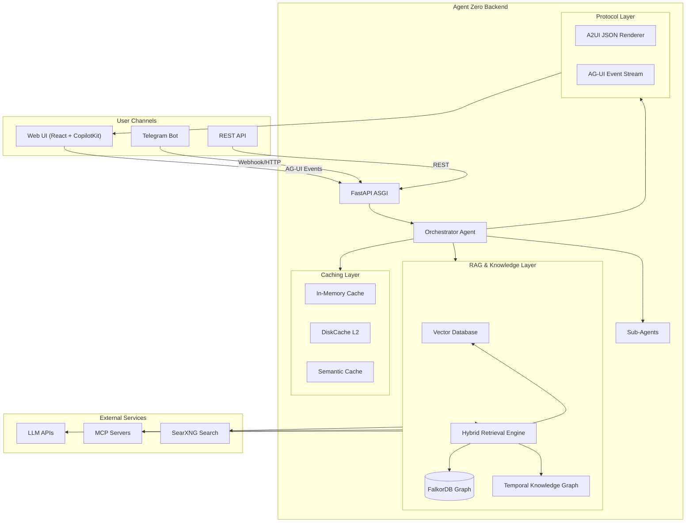
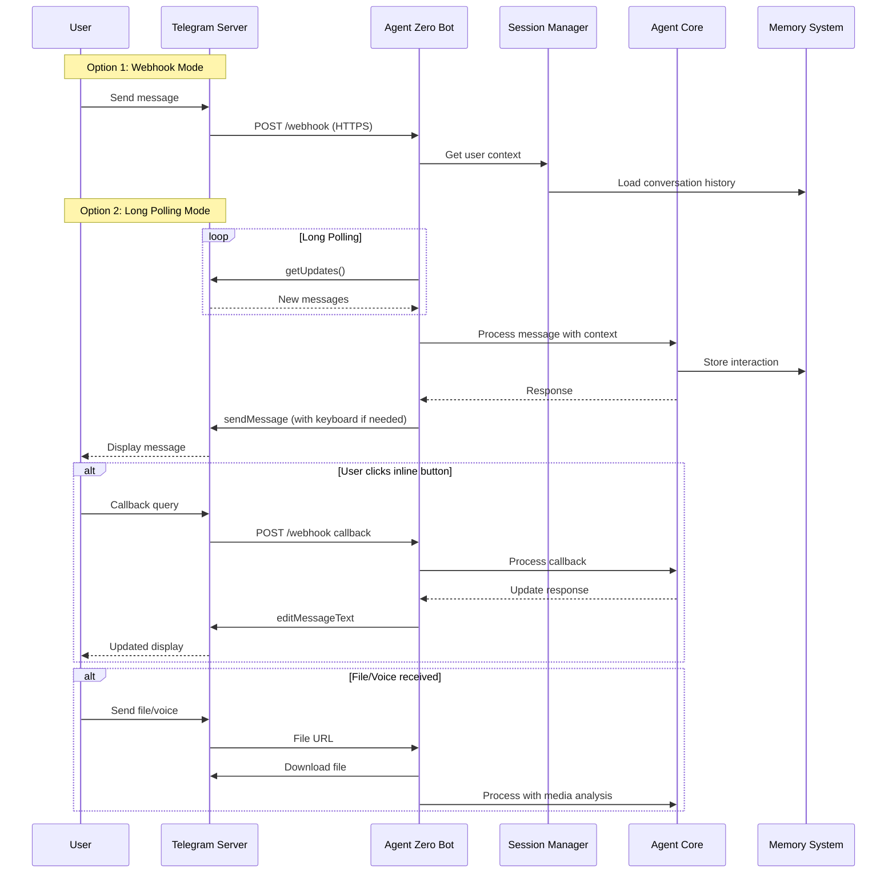
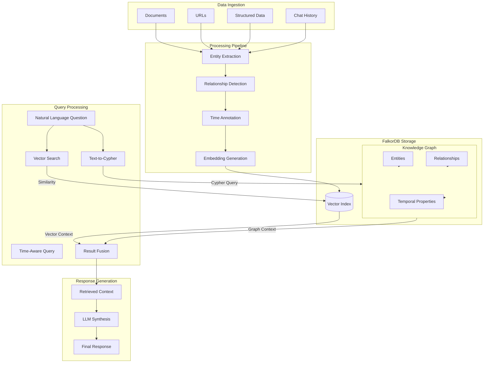
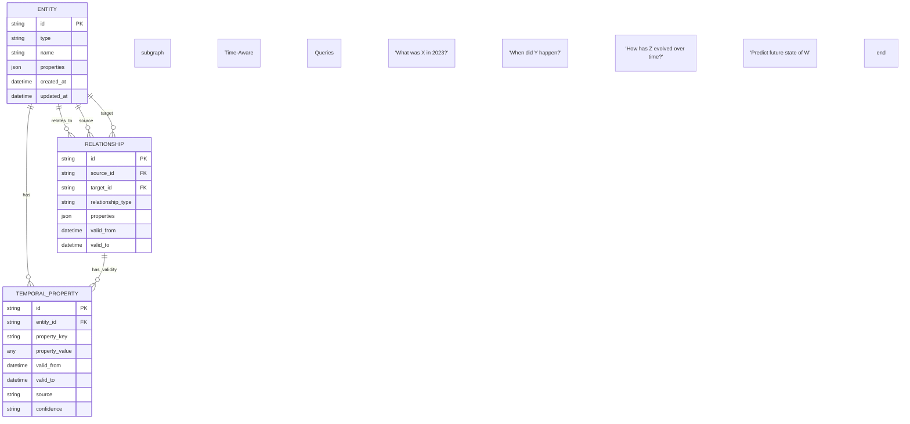
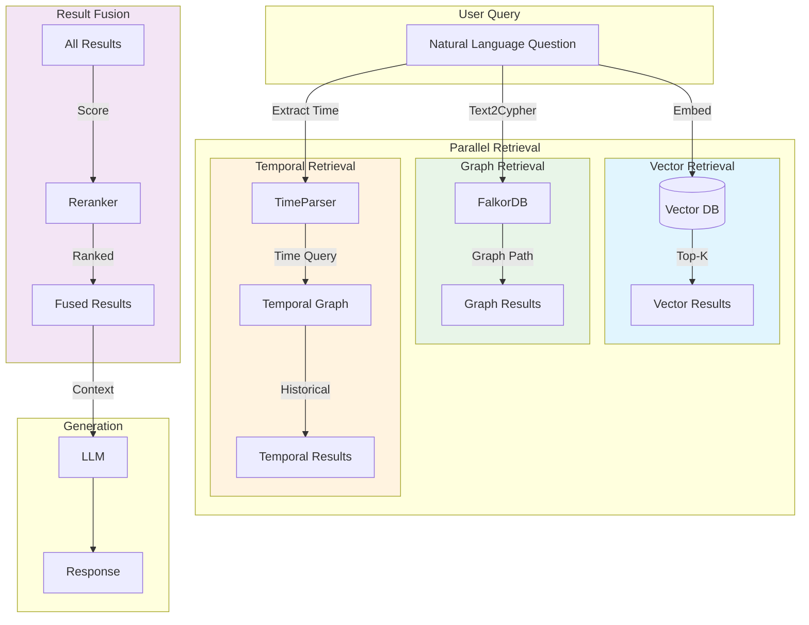
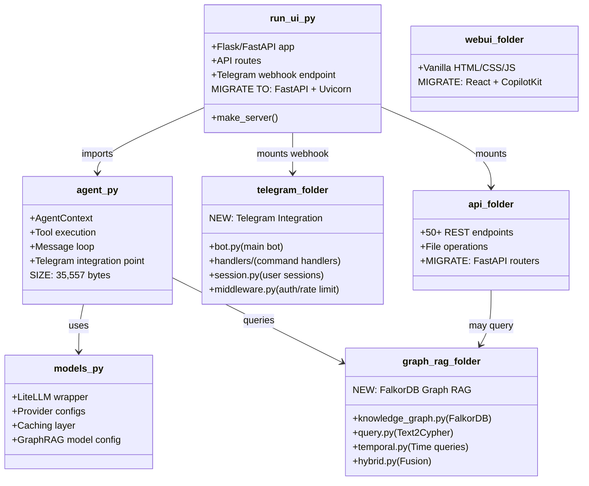
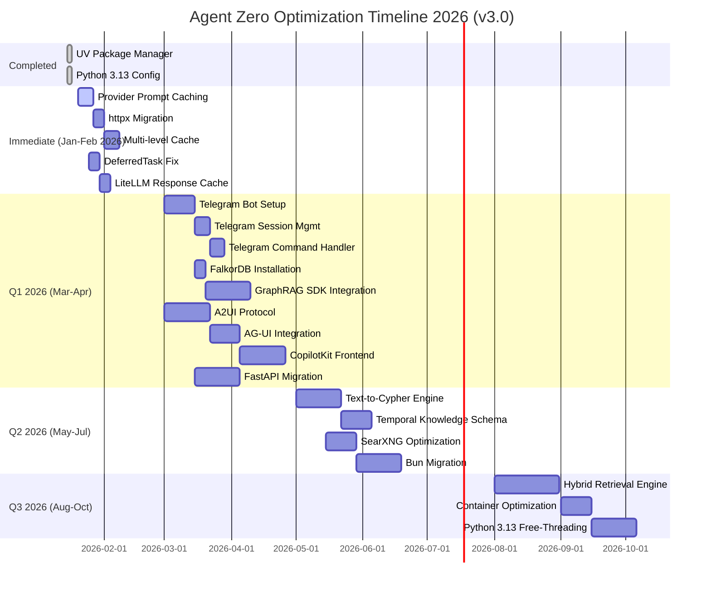

# Agent Zero Optimization Plan v3.0

> **Document Version**: 3.0
> **Created**: 2026-01-18
> **Last Updated**: 2026-01-18
> **Status**: Active

---

## Executive Summary

### Completed Optimizations

| Item | Status | Completion Date |
|------|--------|-----------------|
| UV Package Manager Migration | COMPLETED | 2026-01-16 |
| Python 3.13 Configuration | COMPLETED | 2026-01-16 |
| pyproject.toml Setup | COMPLETED | 2026-01-16 |
| .python-version File | COMPLETED | 2026-01-16 |

### v3.0 New Major Features

This version introduces **TWO NEW PRIORITY INITIATIVES**:

1. **Telegram Bot Integration** - Multi-channel communication support
   - Webhook and Long Polling modes
   - Multi-user session management
   - File sharing and voice message handling
   - Interactive buttons and context preservation

2. **FalkorDB Temporal Graph RAG** - Advanced knowledge representation
   - FalkorDB graph database integration
   - Text-to-Cypher query generation via GraphRAG SDK
   - Temporal knowledge base with time-aware queries
   - Hybrid retrieval: vector + graph + temporal

### v2.0 Features (Carried Forward)

| Item | Status | Priority |
|------|--------|----------|
| A2UI/AG-UI/CopilotKit Integration | PENDING | P0 (Critical) |
| LLM Caching (3-tier) | PENDING | P1 (High) |
| httpx + Connection Pooling | PENDING | P1 (High) |
| Multi-level Cache | PENDING | P1 (High) |
| Flask to FastAPI Migration | PENDING | P2 (Medium) |
| SearXNG Optimization | PENDING | P2 (Medium) |
| Bun vs NodeJS | PENDING | P2 (Medium) |
| Container Optimization | PENDING | P3 (Low) |

### Optimization Categories (v3.0 Complete View)

| Category | Priority | Impact | Status |
|----------|----------|--------|--------|
| **Telegram Bot Integration** | P0 (Critical) | Multi-channel UX | NEW |
| **FalkorDB Graph RAG** | P0 (Critical) | Knowledge reasoning | NEW |
| A2UI/AG-UI/CopilotKit | P0 (Critical) | Revolutionary UX | Pending |
| LLM Caching (3-tier) | P1 (High) | 70-95% cost reduction | Pending |
| httpx + Connection Pooling | P1 (High) | HTTP/2, reduced latency | Pending |
| Multi-level Cache | P1 (High) | 60-80% API reduction | Pending |
| Flask to FastAPI Migration | P2 (Medium) | Native async, 3-4x throughput | Pending |
| SearXNG Optimization | P2 (Medium) | 2-3x search speed | Pending |
| Bun vs NodeJS | P2 (Medium) | 5-8x cold start | Pending |
| Container Optimization | P3 (Low) | 50% image size | Pending |

---

## Section 1: JSON Task Registry (v3.0)

```json
{
  "version": "3.0",
  "created": "2026-01-18",
  "tasks": [
    {
      "id": "T001",
      "category": "infrastructure",
      "title": "UV Package Manager Migration",
      "priority": "P0",
      "status": "done",
      "complexity": "low",
      "impact": "10-100x faster package operations, unified tooling",
      "dependencies": [],
      "entry_points": ["pyproject.toml", ".python-version"],
      "phase": "immediate",
      "completed_date": "2026-01-16"
    },
    {
      "id": "T002",
      "category": "infrastructure",
      "title": "Python 3.13 Upgrade",
      "priority": "P0",
      "status": "done",
      "complexity": "medium",
      "impact": "5-30% performance improvement, JIT compilation, 7% memory reduction",
      "dependencies": ["T001"],
      "entry_points": [".python-version", "pyproject.toml"],
      "phase": "immediate",
      "completed_date": "2026-01-16"
    },
    {
      "id": "T003",
      "category": "ui-architecture",
      "title": "A2UI Protocol Integration",
      "priority": "P0",
      "status": "pending",
      "complexity": "high",
      "impact": "Declarative JSON UI rendering, security-first component catalog",
      "dependencies": [],
      "entry_points": ["agent.py", "python/api/", "webui/"],
      "phase": "q1",
      "requirements": {
        "message_types": ["surfaceUpdate", "dataModelUpdate", "beginRendering", "deleteSurface"],
        "format": "JSONL streaming"
      }
    },
    {
      "id": "T004",
      "category": "ui-architecture",
      "title": "AG-UI Protocol Integration",
      "priority": "P0",
      "status": "pending",
      "complexity": "high",
      "impact": "Bi-directional event streaming, multi-agent support, MCP handshake",
      "dependencies": ["T003"],
      "entry_points": ["agent.py", "python/api/", "run_ui.py"],
      "phase": "q1",
      "requirements": {
        "features": ["event_streaming", "multi_agent", "long_running_agents", "mcp_handshake"]
      }
    },
    {
      "id": "T005",
      "category": "ui-architecture",
      "title": "CopilotKit Frontend Integration",
      "priority": "P0",
      "status": "pending",
      "complexity": "high",
      "impact": "React hooks, real-time state sync, human-in-the-loop checkpoints",
      "dependencies": ["T003", "T004"],
      "entry_points": ["webui/", "package.json"],
      "phase": "q1",
      "requirements": {
        "framework": "React",
        "hooks": ["useAgent", "useCopilotAction", "useCopilotReadable"]
      }
    },
    {
      "id": "T006",
      "category": "performance",
      "title": "LLM Caching - Provider Prompt Caching",
      "priority": "P1",
      "status": "pending",
      "complexity": "low",
      "impact": "50-90% cost reduction on cached prompts",
      "dependencies": [],
      "entry_points": ["models.py", "prompts/"],
      "phase": "immediate",
      "requirements": {
        "anthropic": "cache_control with 1h TTL",
        "openai": "automatic for 1024+ tokens",
        "openrouter": "automatic routing to warm caches"
      }
    },
    {
      "id": "T007",
      "category": "performance",
      "title": "LLM Caching - Response Caching (LiteLLM)",
      "priority": "P1",
      "status": "pending",
      "complexity": "low",
      "impact": "30-60% additional cost reduction",
      "dependencies": [],
      "entry_points": ["models.py", "conf/model_providers.yaml"],
      "phase": "immediate"
    },
    {
      "id": "T008",
      "category": "performance",
      "title": "LLM Caching - Semantic Caching",
      "priority": "P1",
      "status": "pending",
      "complexity": "medium",
      "impact": "20-40% additional cost reduction via similarity matching",
      "dependencies": ["T007"],
      "entry_points": ["models.py"],
      "phase": "q1"
    },
    {
      "id": "T009",
      "category": "networking",
      "title": "httpx + Connection Pooling",
      "priority": "P1",
      "status": "pending",
      "complexity": "low",
      "impact": "HTTP/2 support, reduced latency, connection reuse",
      "dependencies": [],
      "entry_points": ["python/helpers/", "python/tools/"],
      "phase": "immediate",
      "requirements": {
        "replace": "requests library",
        "with": "httpx AsyncClient",
        "config": {
          "max_keepalive_connections": 20,
          "max_connections": 100,
          "http2": true
        }
      }
    },
    {
      "id": "T010",
      "category": "performance",
      "title": "Multi-level Cache (cachetools L1 + DiskCache L2)",
      "priority": "P1",
      "status": "pending",
      "complexity": "low",
      "impact": "60-80% API call reduction",
      "dependencies": [],
      "entry_points": ["python/helpers/search_engine.py", "python/helpers/memory.py"],
      "phase": "immediate"
    },
    {
      "id": "T011",
      "category": "architecture",
      "title": "Flask to FastAPI Migration",
      "priority": "P2",
      "status": "pending",
      "complexity": "medium",
      "impact": "Native async, 3-4x throughput, automatic OpenAPI docs",
      "dependencies": ["T009"],
      "entry_points": ["run_ui.py", "python/api/"],
      "phase": "q1"
    },
    {
      "id": "T012",
      "category": "performance",
      "title": "SearXNG Optimization",
      "priority": "P2",
      "status": "pending",
      "complexity": "low",
      "impact": "2-3x search speed improvement",
      "dependencies": [],
      "entry_points": ["docker-compose.yml", "searxng/settings.yml"],
      "phase": "q2"
    },
    {
      "id": "T013",
      "category": "infrastructure",
      "title": "Bun Migration (from NodeJS)",
      "priority": "P2",
      "status": "pending",
      "complexity": "medium",
      "impact": "5-8x cold start, 3-4x HTTP throughput, 10-20x package installs",
      "dependencies": [],
      "entry_points": ["package.json", "webui/", "a0-launcher/"],
      "phase": "q2"
    },
    {
      "id": "T014",
      "category": "infrastructure",
      "title": "Container Optimization (Multi-stage builds)",
      "priority": "P3",
      "status": "pending",
      "complexity": "medium",
      "impact": "50% image size reduction, faster deployments",
      "dependencies": [],
      "entry_points": ["Dockerfile", "DockerfileLocal"],
      "phase": "q3"
    },
    {
      "id": "T015",
      "category": "architecture",
      "title": "DeferredTask asyncio.run() Fix",
      "priority": "P1",
      "status": "pending",
      "complexity": "medium",
      "impact": "Eliminate event loop blocking, enable proper async flow",
      "dependencies": [],
      "entry_points": ["python/helpers/defer.py"],
      "phase": "immediate",
      "requirements": {
        "replace": "asyncio.run() in sync context",
        "with": "asyncio.Runner() for reusable event loop"
      }
    },
    {
      "id": "T016",
      "category": "telegram",
      "title": "Telegram Bot Setup (Webhook/Polling)",
      "priority": "P0",
      "status": "pending",
      "complexity": "medium",
      "impact": "Multi-channel communication, 24/7 availability",
      "dependencies": [],
      "entry_points": ["python/telegram/", "run_ui.py", "conf/"],
      "phase": "q1",
      "requirements": {
        "library": "python-telegram-bot>=20.0",
        "modes": ["webhook", "long_polling"],
        "webhook_config": {
          "url": "https://your-domain.com/webhook",
          "secret_token": "secure_token"
        }
      }
    },
    {
      "id": "T017",
      "category": "telegram",
      "title": "Telegram Session Management",
      "priority": "P0",
      "status": "pending",
      "complexity": "medium",
      "impact": "Multi-user support, conversation continuity",
      "dependencies": ["T016"],
      "entry_points": ["python/telegram/session.py", "python/memory/"],
      "phase": "q1",
      "requirements": {
        "features": ["user_isolation", "context_persistence", "conversation_history"]
      }
    },
    {
      "id": "T018",
      "category": "telegram",
      "title": "Telegram Command Handler",
      "priority": "P0",
      "status": "pending",
      "complexity": "medium",
      "impact": "Rich bot interactions, inline keyboards, file handling",
      "dependencies": ["T016", "T017"],
      "entry_points": ["python/telegram/handlers/", "agent.py"],
      "phase": "q1",
      "requirements": {
        "commands": ["/start", "/help", "/clear", "/agent"],
        "features": ["inline_keyboard", "callback_queries", "file_download", "voice"]
      }
    },
    {
      "id": "T019",
      "category": "graph-rag",
      "title": "FalkorDB Installation & Setup",
      "priority": "P0",
      "status": "pending",
      "complexity": "low",
      "impact": "Graph database backend for knowledge representation",
      "dependencies": [],
      "entry_points": ["docker-compose.yml", "conf/"],
      "phase": "q1",
      "requirements": {
        "installation": "docker run -p 6379:6379 -p 3000:3000 -it --rm falkordb/falkordb:edge",
        "python_client": "pip install falkordb graphrag_sdk",
        "config": "FALKORDB_HOST, FALKORDB_PORT, FALKORDB_USERNAME, FALKORDB_PASSWORD"
      }
    },
    {
      "id": "T020",
      "category": "graph-rag",
      "title": "GraphRAG SDK Integration",
      "priority": "P0",
      "status": "pending",
      "complexity": "high",
      "impact": "Text-to-Cypher, ontology management, conversational RAG",
      "dependencies": ["T019"],
      "entry_points": ["python/graph_rag/", "models.py"],
      "phase": "q1",
      "requirements": {
        "sdk": "graphrag_sdk",
        "features": ["KnowledgeGraph", "Ontology", "Text2Cypher", "ChatSession"]
      }
    },
    {
      "id": "T021",
      "category": "graph-rag",
      "title": "Text-to-Cypher Query Engine",
      "priority": "P0",
      "status": "pending",
      "complexity": "high",
      "impact": "Natural language graph queries, semantic search",
      "dependencies": ["T019", "T020"],
      "entry_points": ["python/graph_rag/query.py", "prompts/"],
      "phase": "q2",
      "requirements": {
        "model": "openai/gpt-4.1 or litellm wrapper",
        "features": ["natural_language", "streaming", "context_awareness"]
      }
    },
    {
      "id": "T022",
      "category": "graph-rag",
      "title": "Temporal Knowledge Base Schema",
      "priority": "P0",
      "status": "pending",
      "complexity": "high",
      "impact": "Time-aware queries, historical context, evolving knowledge",
      "dependencies": ["T019"],
      "entry_points": ["python/graph_rag/temporal.py", "python/memory/"],
      "phase": "q2",
      "requirements": {
        "features": ["time_intervals", "validity_periods", "versioned_nodes", "temporal_queries"],
        "schema": "entity -> [temporal_property] -> value"
      }
    },
    {
      "id": "T023",
      "category": "graph-rag",
      "title": "Hybrid Retrieval (Vector + Graph + Temporal)",
      "priority": "P1",
      "status": "pending",
      "complexity": "very_high",
      "impact": "Combined semantic, relational, and temporal search",
      "dependencies": ["T020", "T022", "T008"],
      "entry_points": ["python/graph_rag/hybrid.py", "python/helpers/search_engine.py"],
      "phase": "q3",
      "requirements": {
        "fusion": "hybrid_search combining vector, graph, temporal results",
        "ranking": "weighted scoring across retrieval methods"
      }
    }
  ]
}
```

---

## Section 2: Architecture Diagrams

### 2.1 Complete System Architecture (v3.0)



### 2.2 Telegram Bot Integration Flow



### 2.3 FalkorDB Graph RAG Pipeline



### 2.4 Temporal Knowledge Base Schema



### 2.5 Hybrid Retrieval Architecture



### 2.6 Entry Points and Dependencies (Updated)



### 2.7 Implementation Timeline (Gantt) - v3.0



---

## Section 3: Implementation Details

### 3.1 Telegram Bot Integration

#### Current State
- No Telegram integration
- Web UI only access
- No multi-channel support

#### Target State
- Full-featured Telegram bot
- Webhook and long polling modes
- Multi-user session management
- Rich interactions (inline keyboards, files, voice)
- Context preserved across messages

#### Step-by-Step Actions

##### 3.1.1 Project Structure

```
python/telegram/
├── __init__.py
├── bot.py                 # Main Application class
├── config.py              # Configuration management
├── handlers/
│   ├── __init__.py
│   ├── command_handler.py # /start, /help, /clear, /agent
│   ├── message_handler.py # Text, file, voice processing
│   ├── callback_handler.py # Inline keyboard callbacks
│   └── error_handler.py   # Exception handling
├── session.py             # User session management
├── middleware.py          # Auth, rate limiting
└── utils/
    ├── __init__.py
    ├── file_utils.py      # File download/upload
    └── voice_utils.py     # Voice-to-text
```

##### 3.1.2 Bot Configuration

```python
# python/telegram/config.py
from pydantic_settings import BaseSettings
from functools import lru_cache
import os


class TelegramSettings(BaseSettings):
    """Telegram bot configuration"""
    
    # Bot Token (from @BotFather)
    bot_token: str = ""
    
    # Webhook Configuration
    webhook_enabled: bool = True
    webhook_url: str = ""
    webhook_secret_token: str = ""
    
    # Long Polling Configuration
    polling_enabled: bool = False
    polling_interval: float = 1.0
    polling_timeout: int = 60
    
    # Session Configuration
    session_ttl_hours: int = 24
    max_conversations_per_user: int = 5
    
    # Feature Flags
    enable_voice: bool = True
    enable_files: bool = True
    enable_inline_keyboard: bool = True
    enable_context_persistence: bool = True
    
    # Rate Limiting
    rate_limit_per_user: int = 30  # messages per minute
    rate_limit_per_chat: int = 100
    
    class Config:
        env_prefix = "TELEGRAM_"
        env_file = ".env"
        env_file_encoding = "utf-8"


@lru_cache()
def get_telegram_settings() -> TelegramSettings:
    """Get cached settings instance"""
    return TelegramSettings()


# Export settings instance
telegram_settings = get_telegram_settings()
```

##### 3.1.3 Main Bot Application

```python
# python/telegram/bot.py
import logging
import asyncio
from typing import Optional
from contextlib import asynccontextmanager

from telegram import Update, InlineKeyboardButton, InlineKeyboardMarkup
from telegram.ext import (
    Application,
    ApplicationBuilder,
    CommandHandler,
    MessageHandler,
    CallbackQueryHandler,
    ContextTypes,
    filters,
)
from telegram.error import TelegramError

from .config import get_telegram_settings
from .session import SessionManager
from .handlers import setup_handlers
from .middleware import setup_middleware

logger = logging.getLogger(__name__)


class TelegramBot:
    """Agent Zero Telegram Bot Application"""
    
    def __init__(self):
        self.settings = get_telegram_settings()
        self.application: Optional[Application] = None
        self.session_manager: Optional[SessionManager] = None
        self._shutdown_event = asyncio.Event()
    
    async def initialize(self):
        """Initialize bot components"""
        logger.info("Initializing Telegram Bot...")
        
        # Initialize session manager
        self.session_manager = SessionManager(
            ttl_hours=self.settings.session_ttl_hours,
            max_conversations=self.settings.max_conversations_per_user
        )
        
        # Build application
        self.application = (
            ApplicationBuilder()
            .token(self.settings.bot_token)
            .concurrent_updates(10)
            .read_timeout(30)
            .write_timeout(30)
            .connect_timeout(30)
            .pool_timeout(30)
            .build()
        )
        
        # Setup middleware
        setup_middleware(self.application, self.session_manager)
        
        # Setup handlers
        setup_handlers(self.application, self.session_manager)
        
        # Initialize application
        await self.application.initialize()
        
        logger.info("Telegram Bot initialized successfully")
    
    async def start(self):
        """Start the bot in configured mode"""
        if not self.application:
            await self.initialize()
        
        if self.settings.webhook_enabled:
            await self._start_webhook()
        else:
            await self._start_polling()
    
    async def _start_webhook(self):
        """Start webhook mode"""
        logger.info(f"Starting webhook mode: {self.settings.webhook_url}")
        
        await self.application.bot.set_webhook(
            url=self.settings.webhook_url,
            secret_token=self.settings.webhook_secret_token,
            drop_pending_updates=True
        )
        
        await self.application.start()
        await self.application.updater.start_webhook(
            webhook_url=self.settings.webhook_url,
            secret_token=self.settings.webhook_secret_token
        )
    
    async def _start_polling(self):
        """Start long polling mode"""
        logger.info("Starting long polling mode...")
        
        await self.application.start()
        await self.application.updater.start_polling(
            poll_interval=self.settings.polling_interval,
            timeout=self.settings.polling_timeout,
            drop_pending_updates=True
        )
    
    async def stop(self):
        """Gracefully stop the bot"""
        logger.info("Stopping Telegram Bot...")
        
        if self.application:
            await self.application.stop()
            await self.application.shutdown()
        
        if self.session_manager:
            await self.session_manager.close()
        
        self._shutdown_event.set()
        logger.info("Telegram Bot stopped")
    
    async def run_until_shutdown(self):
        """Run until shutdown signal received"""
        await self.start()
        
        try:
            await self._shutdown_event.wait()
        except asyncio.CancelledError:
            await self.stop()


# Singleton instance
_bot_instance: Optional[TelegramBot] = None


async def get_bot() -> TelegramBot:
    """Get or create bot singleton"""
    global _bot_instance
    if _bot_instance is None:
        _bot_instance = TelegramBot()
    return _bot_instance
```

##### 3.1.4 Session Management

```python
# python/telegram/session.py
import json
import time
import asyncio
from typing import Optional, Dict, Any, List
from dataclasses import dataclass, field, asdict
from datetime import datetime, timedelta
import hashlib

from python.memory.memory_manager import MemoryManager


@dataclass
class ConversationMessage:
    """Single message in conversation history"""
    role: str  # 'user', 'assistant', 'system'
    content: str
    timestamp: float = field(default_factory=time.time)
    metadata: Dict[str, Any] = field(default_factory=dict)


@dataclass
class UserSession:
    """User session with conversation context"""
    user_id: int
    chat_id: int
    conversation: List[ConversationMessage] = field(default_factory=list)
    created_at: float = field(default_factory=time.time)
    last_activity: float = field(default_factory=time.time)
    is_active: bool = True
    metadata: Dict[str, Any] = field(default_factory=dict)
    
    def add_message(self, role: str, content: str, metadata: Dict[str, Any] = None):
        """Add message to conversation"""
        self.conversation.append(ConversationMessage(
            role=role,
            content=content,
            metadata=metadata or {}
        ))
        self.last_activity = time.time()
    
    def get_history(self, max_messages: int = 20) -> List[Dict]:
        """Get conversation history for LLM"""
        recent = self.conversation[-max_messages:]
        return [
            {"role": msg.role, "content": msg.content}
            for msg in recent
        ]
    
    def clear_history(self):
        """Clear conversation history but keep metadata"""
        self.conversation.clear()
    
    def is_expired(self, ttl_hours: int) -> bool:
        """Check if session is expired"""
        expiry = datetime.fromtimestamp(self.last_activity) + timedelta(hours=ttl_hours)
        return datetime.now() > expiry


class SessionManager:
    """Multi-user session management"""
    
    def __init__(
        self,
        ttl_hours: int = 24,
        max_conversations: int = 5,
        persist_to_disk: bool = True
    ):
        self.ttl_hours = ttl_hours
        self.max_conversations = max_conversations
        self.persist_to_disk = persist_to_disk
        
        # In-memory session storage
        self._sessions: Dict[int, UserSession] = {}
        self._lock = asyncio.Lock()
        
        # Persistence
        self._persist_path = "/tmp/telegram_sessions.json"
        
        # Optional: Integrate with Agent Zero memory
        self._memory_manager: Optional[MemoryManager] = None
    
    async def initialize(self, memory_manager: MemoryManager = None):
        """Initialize session manager"""
        self._memory_manager = memory_manager
        
        if self.persist_to_disk:
            await self._load_from_disk()
    
    def _get_session_key(self, user_id: int, chat_id: int) -> int:
        """Generate unique session key"""
        return user_id
    
    async def get_session(
        self,
        user_id: int,
        chat_id: int,
        create_if_missing: bool = True
    ) -> Optional[UserSession]:
        """Get or create user session"""
        async with self._lock:
            key = self._get_session_key(user_id, chat_id)
            
            if key in self._sessions:
                session = self._sessions[key]
                if not session.is_expired(self.ttl_hours):
                    return session
                else:
                    # Session expired, remove it
                    del self._sessions[key]
            
            if create_if_missing:
                session = UserSession(user_id=user_id, chat_id=chat_id)
                self._sessions[key] = session
                return session
            
            return None
    
    async def add_message(
        self,
        user_id: int,
        chat_id: int,
        role: str,
        content: str,
        metadata: Dict[str, Any] = None
    ):
        """Add message to user session"""
        session = await self.get_session(user_id, chat_id)
        if session:
            session.add_message(role, content, metadata)
            
            # Persist to disk
            if self.persist_to_disk:
                await self._save_to_disk()
    
    async def get_history(
        self,
        user_id: int,
        chat_id: int,
        max_messages: int = 20
    ) -> List[Dict]:
        """Get conversation history"""
        session = await self.get_session(user_id, chat_id, create_if_missing=False)
        if session:
            return session.get_history(max_messages)
        return []
    
    async def clear_history(self, user_id: int, chat_id: int):
        """Clear conversation history"""
        session = await self.get_session(user_id, chat_id, create_if_missing=False)
        if session:
            session.clear_history()
            if self.persist_to_disk:
                await self._save_to_disk()
    
    async def close(self):
        """Cleanup and persist sessions"""
        if self.persist_to_disk:
            await self._save_to_disk()
        self._sessions.clear()
    
    async def _save_to_disk(self):
        """Persist sessions to disk"""
        try:
            data = {
                str(k): {
                    "user_id": v.user_id,
                    "chat_id": v.chat_id,
                    "conversation": [
                        {
                            "role": msg.role,
                            "content": msg.content,
                            "timestamp": msg.timestamp,
                            "metadata": msg.metadata
                        }
                        for msg in v.conversation
                    ],
                    "created_at": v.created_at,
                    "last_activity": v.last_activity,
                    "is_active": v.is_active,
                    "metadata": v.metadata
                }
                for k, v in self._sessions.items()
            }
            
            with open(self._persist_path, 'w') as f:
                json.dump(data, f)
        except Exception as e:
            logging.error(f"Failed to save sessions: {e}")
    
    async def _load_from_disk(self):
        """Load sessions from disk"""
        try:
            if not os.path.exists(self._persist_path):
                return
            
            with open(self._persist_path, 'r') as f:
                data = json.load(f)
            
            for key, session_data in data.items():
                key = int(key)
                session = UserSession(
                    user_id=session_data["user_id"],
                    chat_id=session_data["chat_id"],
                    created_at=session_data["created_at"],
                    last_activity=session_data["last_activity"],
                    is_active=session_data["is_active"],
                    metadata=session_data.get("metadata", {})
                )
                
                for msg_data in session_data["conversation"]:
                    session.conversation.append(ConversationMessage(
                        role=msg_data["role"],
                        content=msg_data["content"],
                        timestamp=msg_data["timestamp"],
                        metadata=msg_data.get("metadata", {})
                    ))
                
                self._sessions[key] = session
                
        except Exception as e:
            logging.error(f"Failed to load sessions: {e}")
```

##### 3.1.5 Command Handlers

```python
# python/telegram/handlers/command_handler.py
from telegram import Update, InlineKeyboardButton, InlineKeyboardMarkup
from telegram.ext import ContextTypes, CommandHandler
import logging

from ..session import SessionManager

logger = logging.getLogger(__name__)


async def start_command(update: Update, context: ContextTypes.DEFAULT_TYPE):
    """Handle /start command"""
    user = update.effective_user
    chat = update.effective_chat
    
    welcome_message = (
        f"Hello {user.full_name}! I'm Agent Zero, an autonomous AI assistant.\n\n"
        "I can help you with:\n"
        "- Answering questions\n"
        "- Writing and analyzing code\n"
        "- Searching the web\n"
        "- Managing files\n"
        "- And much more!\n\n"
        "Just send me a message to get started."
    )
    
    # Create main menu keyboard
    keyboard = [
        [InlineKeyboardButton("Help", callback_data="help"),
         InlineKeyboardButton("Clear Context", callback_data="clear")],
        [InlineKeyboardButton("Start New Chat", callback_data="new_chat")]
    ]
    reply_markup = InlineKeyboardMarkup(keyboard)
    
    await update.message.reply_text(welcome_message, reply_markup=reply_markup)
    
    logger.info(f"User {user.id} started conversation")


async def help_command(update: Update, context: ContextTypes.DEFAULT_TYPE):
    """Handle /help command"""
    help_text = (
        "Agent Zero - Available Commands:\n\n"
        "/start - Start a new conversation\n"
        "/help - Show this help message\n"
        "/clear - Clear conversation history\n"
        "/agent <message> - Send a message to the agent\n\n"
        "You can also just send me a message directly!\n\n"
        "Features:\n"
        "- Multi-turn conversation with context\n"
        "- File upload and analysis\n"
        "- Voice message support\n"
        "- Code execution and analysis"
    )
    
    keyboard = [
        [InlineKeyboardButton("Back to Menu", callback_data="menu")]
    ]
    reply_markup = InlineKeyboardMarkup(keyboard)
    
    await update.message.reply_text(help_text, reply_markup=reply_markup)


async def clear_command(update: Update, context: ContextTypes.DEFAULT_TYPE):
    """Handle /clear command"""
    user = update.effective_user
    chat = update.effective_chat
    
    session_manager: SessionManager = context.chat_data.get("session_manager")
    
    if session_manager:
        await session_manager.clear_history(user.id, chat.id)
    
    await update.message.reply_text(
        "Conversation history cleared. Starting fresh!"
    )
    
    logger.info(f"User {user.id} cleared conversation history")


async def agent_command(update: Update, context: ContextTypes.DEFAULT_TYPE):
    """Handle /agent command with explicit agent invocation"""
    user = update.effective_user
    chat = update.effective_chat
    
    # Get message text after /agent
    message_text = " ".join(context.args)
    
    if not message_text:
        await update.message.reply_text(
            "Please provide a message. Usage: /agent <your question>"
        )
        return
    
    # Process through agent (integration with agent.py)
    session_manager: SessionManager = context.chat_data.get("session_manager")
    
    # This would integrate with the main agent
.agent import process    from python_message
    
    try:
        response = await process_message(
            message=message_text,
            user_id=user.id,
            chat_id=chat.id,
            session_manager=session_manager
        )
        
        await update.message.reply_text(response)
        
    except Exception as e:
        logger.error(f"Agent processing error: {e}")
        await update.message.reply_text(
            "Sorry, I encountered an error. Please try again."
        )


def setup_command_handlers(application, session_manager: SessionManager):
    """Register command handlers"""
    
    async def with_session(update: Update, context: ContextTypes.DEFAULT_TYPE):
        # Attach session manager to context
        context.chat_data["session_manager"] = session_manager
        
        # Route to appropriate handler
        command = update.message.text.split()[0]
        command_map = {
            "/start": start_command,
            "/help": help_command,
            "/clear": clear_command,
            "/agent": agent_command,
        }
        
        handler = command_map.get(command)
        if handler:
            await handler(update, context)
    
    # Register handlers
    handlers = [
        CommandHandler("start", start_command),
        CommandHandler("help", help_command),
        CommandHandler("clear", clear_command),
        CommandHandler("agent", agent_command),
    ]
    
    for handler in handlers:
        application.add_handler(handler)
```

##### 3.1.6 Message Handler with Files and Voice

```python
# python/telegram/handlers/message_handler.py
import os
import tempfile
import logging
from typing import Optional
from telegram import Update
from telegram.ext import ContextTypes, MessageHandler, filters

from ..session import SessionManager
from ..utils.file_utils import download_file
from ..utils.voice_utils import transcribe_voice

logger = logging.getLogger(__name__)


async def text_message(update: Update, context: ContextTypes.DEFAULT_TYPE):
    """Handle text messages"""
    user = update.effective_user
    chat = update.effective_chat
    message_text = update.message.text
    
    # Skip commands (already handled by command handler)
    if message_text.startswith("/"):
        return
    
    session_manager: SessionManager = context.chat_data.get("session_manager")
    
    # Add user message to session
    if session_manager:
        await session_manager.add_message(
            user_id=user.id,
            chat_id=chat.id,
            role="user",
            content=message_text
        )
    
    # Process through agent
    from python.agent import process_message
    
    try:
        # Show typing indicator
        await context.bot.send_chat_action(chat_id=chat.id, action="typing")
        
        response = await process_message(
            message=message_text,
            user_id=user.id,
            chat_id=chat.id,
            session_manager=session_manager
        )
        
        # Send response
        await update.message.reply_text(response)
        
        # Add assistant response to session
        if session_manager:
            await session_manager.add_message(
                user_id=user.id,
                chat_id=chat.id,
                role="assistant",
                content=response
            )
            
    except Exception as e:
        logger.error(f"Message processing error: {e}")
        await update.message.reply_text(
            "Sorry, I encountered an error processing your message."
        )


async def voice_message(update: Update, context: ContextTypes.DEFAULT_TYPE):
    """Handle voice messages"""
    user = update.effective_user
    chat = update.effective_chat
    
    voice = update.message.voice
    
    # Show typing indicator
    await context.bot.send_chat_action(chat_id=chat.id, action="typing")
    
    try:
        # Download voice file
        voice_file = await context.bot.get_file(voice.file_id)
        
        with tempfile.NamedTemporaryFile(suffix=".ogg", delete=False) as tmp:
            tmp_path = tmp.name
            await voice_file.download_to_memory(tmp)
        
        # Transcribe voice to text
        transcription = await transcribe_voice(tmp_path)
        
        # Clean up
        os.unlink(tmp_path)
        
        if transcription:
            # Process as text message
            await text_message(update, context)
            
            # Optionally send transcription
            await update.message.reply_text(
                f"Voice message transcribed:\n{transcription}"
            )
        else:
            await update.message.reply_text(
                "Sorry, I couldn't transcribe your voice message."
            )
            
    except Exception as e:
        logger.error(f"Voice processing error: {e}")
        await update.message.reply_text(
            "Sorry, I encountered an error processing your voice message."
        )


async def document_message(update: Update, context: ContextTypes.DEFAULT_TYPE):
    """Handle document/file uploads"""
    user = update.effective_user
    chat = update.effective_chat
    
    document = update.message.document
    
    # Show typing indicator
    await context.bot.send_chat_action(chat_id=chat.id, action="typing")
    
    try:
        # Download file
        file_path = await download_file(
            context.bot,
            document.file_id,
            document.file_name
        )
        
        # Process file based on type
        file_type = document.mime_type
        
        if file_type and file_type.startswith("image/"):
            # Process image
            result = await process_image_file(file_path)
        elif file_type == "application/pdf":
            # Process PDF
            result = await process_pdf_file(file_path)
        elif "text" in file_type:
            # Process text file
            with open(file_path, 'r') as f:
                result = f.read()
        else:
            result = f"File received: {document.file_name}"
        
        # Clean up
        os.unlink(file_path)
        
        await update.message.reply_text(
            f"File processed:\n{result[:1000]}{'...' if len(result) > 1000 else ''}"
        )
        
    except Exception as e:
        logger.error(f"Document processing error: {e}")
        await update.message.reply_text(
            "Sorry, I encountered an error processing your file."
        )


def setup_message_handlers(application):
    """Register message handlers"""
    
    # Text messages (excluding commands)
    text_handler = MessageHandler(
        filters.TEXT & ~filters.COMMAND,
        text_message
    )
    
    # Voice messages
    voice_handler = MessageHandler(
        filters.VOICE,
        voice_message
    )
    
    # Documents/files
    document_handler = MessageHandler(
        filters.DOCUMENT,
        document_message
    )
    
    application.add_handler(text_handler)
    application.add_handler(voice_handler)
    application.add_handler(document_handler)
```

##### 3.1.7 Utility Functions

```python
# python/telegram/utils/file_utils.py
import os
import logging
from typing import Optional
from telegram import Bot
from telegram.error import TelegramError

logger = logging.getLogger(__name__)


async def download_file(bot: Bot, file_id: str, filename: Optional[str] = None) -> str:
    """Download file to temporary location"""
    try:
        file = await bot.get_file(file_id)
        
        # Determine save path
        if filename:
            save_dir = "/tmp/telegram_files"
            os.makedirs(save_dir, exist_ok=True)
            save_path = os.path.join(save_dir, filename)
        else:
            with tempfile.NamedTemporaryFile(delete=False) as tmp:
                save_path = tmp.name
        
        await file.download_to_drive(save_path)
        
        logger.info(f"Downloaded file to {save_path}")
        return save_path
        
    except TelegramError as e:
        logger.error(f"Failed to download file: {e}")
        raise


async def upload_file(bot: Bot, chat_id: int, file_path: str) -> bool:
    """Upload file to telegram chat"""
    try:
        with open(file_path, 'rb') as f:
            await bot.send_document(
                chat_id=chat_id,
                document=f,
                filename=os.path.basename(file_path)
            )
        return True
    except TelegramError as e:
        logger.error(f"Failed to upload file: {e}")
        return False
```

```python
# python/telegram/utils/voice_utils.py
import os
import logging
from typing import Optional
import subprocess

logger = logging.getLogger(__name__)


async def transcribe_voice(voice_path: str) -> Optional[str]:
    """Transcribe voice message to text"""
    try:
        # Option 1: Using OpenAI Whisper (if available)
        try:
            import whisper
            model = whisper.load_model("base")
            result = model.transcribe(voice_path)
            return result["text"].strip()
        except ImportError:
            pass
        
        # Option 2: Using subprocess with system whisper
        result = subprocess.run(
            ["whisper", voice_path, "--model", "base", "--language", "en", "--no_timestamps"],
            capture_output=True,
            text=True,
            timeout=120
        )
        
        if result.returncode == 0:
            # Extract text from output
            output_path = voice_path.replace(".ogg", ".txt")
            if os.path.exists(output_path):
                with open(output_path, 'r') as f:
                    text = f.read()
                # Clean up output files
                for ext in ['.txt', '.srt', '.vtt']:
                    out = voice_path.replace(".ogg", ext)
                    if os.path.exists(out):
                        os.unlink(out)
                return text.strip()
        
        logger.warning(f"Whisper transcription failed: {result.stderr}")
        return None
        
    except Exception as e:
        logger.error(f"Voice transcription error: {e}")
        return None
```

##### 3.1.8 Webhook Integration with Flask/FastAPI

```python
# Integration with run_ui.py or FastAPI app
from fastapi import FastAPI, Request, HTTPException, Depends
from telegram import Update
from telegram.error import TelegramUnauthorizedError
import hmac
import hashlib

from python.telegram.bot import get_bot

app = FastAPI()


def verify_secret_token(request: Request, secret_token: str):
    """Verify webhook secret token"""
    if not secret_token:
        return
    
    # Get secret token from header
    token_header = request.headers.get("X-Telegram-Bot-Api-Secret-Token")
    
    if not token_header:
        raise HTTPException(status_code=401, detail="Missing secret token")
    
    if not hmac.compare_digest(token_header, secret_token):
        raise HTTPException(status_code=401, detail="Invalid secret token")


@app.post("/webhook/{bot_token}")
async def telegram_webhook(
    request: Request,
    bot_token: str,
    settings=Depends(get_telegram_settings)
):
    """Telegram webhook endpoint"""
    # Verify secret token
    verify_secret_token(request, settings.webhook_secret_token)
    
    # Verify bot token (for multi-bot support)
    if bot_token != settings.bot_token:
        raise HTTPException(status_code=404, detail="Bot not found")
    
    try:
        bot = await get_bot()
        
        # Parse update
        update = Update.de_json(
            await request.json(),
            bot.application.bot
        )
        
        # Process update through bot application
        await bot.application.process_update(update)
        
        return {"status": "ok"}
        
    except Exception as e:
        logger.error(f"Webhook error: {e}")
        raise HTTPException(status_code=500, detail="Processing error")
```

#### Success Metrics
- Bot response time < 2 seconds
- Message delivery success rate > 99%
- Session persistence across restarts
- Voice transcription accuracy > 90%
- Multi-user isolation verified

---

### 3.2 FalkorDB Graph RAG Integration

#### Current State
- No graph database integration
- Vector-only retrieval
- No temporal knowledge representation

#### Target State
- FalkorDB graph database for knowledge
- Text-to-Cypher natural language queries
- Temporal knowledge base with time-aware queries
- Hybrid retrieval combining vector, graph, temporal

#### Step-by-Step Actions

##### 3.2.1 Project Structure

```
python/graph_rag/
├── __init__.py
├── config.py              # FalkorDB and SDK configuration
├── knowledge_graph.py     # KnowledgeGraph wrapper
├── query.py               # Text-to-Cypher engine
├── ontology.py            # Ontology management
├── temporal.py            # Temporal knowledge schema
├── hybrid.py              # Hybrid retrieval fusion
├── models.py              # LLM model configurations
└── examples/
    ├── basic_chat.py
    └── temporal_query.py
```

##### 3.2.2 Configuration

```python
# python/graph_rag/config.py
from pydantic_settings import BaseSettings
from functools import lru_cache
import os


class FalkorDBSettings(BaseSettings):
    """FalkorDB and GraphRAG configuration"""
    
    # Connection Settings
    host: str = "localhost"
    port: int = 6379
    username: str = ""
    password: str = ""
    
    # Graph Name
    graph_name: str = "agent_zero"
    
    # LLM Configuration
    llm_provider: str = "openai"  # openai, google, groq, litellm
    llm_model: str = "gpt-4.1"
    embedding_model: str = "text-embedding-3-small"
    
    # GraphRAG Settings
    enable_streaming: bool = True
    chat_history_enabled: bool = True
    max_history_messages: int = 10
    
    # Cache Settings
    cache_enabled: bool = True
    cache_ttl_seconds: int = 300
    
    class Config:
        env_prefix = "FALKORDB_"
        env_file = ".env"
        env_file_encoding = "utf-8"


@lru_cache()
def get_falkordb_settings() -> FalkorDBSettings:
    """Get cached settings instance"""
    return FalkorDBSettings()


# Export settings instance
falkordb_settings = get_falkordb_settings()
```

##### 3.2.3 Knowledge Graph Wrapper

```python
# python/graph_rag/knowledge_graph.py
import os
import logging
from typing import Optional, List, Dict, Any
from contextlib import asynccontextmanager

from falkordb import FalkorDB
from graphrag_sdk import KnowledgeGraph, Ontology
from graphrag_sdk.model_config import KnowledgeGraphModelConfig

from .config import get_falkordb_settings

logger = logging.getLogger(__name__)


class GraphRAGManager:
    """Manager for FalkorDB GraphRAG integration"""
    
    def __init__(self):
        self.settings = get_falkordb_settings()
        self._db: Optional[FalkorDB] = None
        self._kg: Optional[KnowledgeGraph] = None
        self._initialized = False
    
    async def initialize(self):
        """Initialize FalkorDB connection and GraphRAG"""
        if self._initialized:
            return
        
        logger.info("Initializing FalkorDB GraphRAG...")
        
        try:
            # Connect to FalkorDB
            self._db = FalkorDB(
                host=self.settings.host,
                port=self.settings.port,
                username=self.settings.username or None,
                password=self.settings.password or None
            )
            
            # Test connection
            self._db.ping()
            logger.info(f"Connected to FalkorDB at {self.settings.host}:{self.settings.port}")
            
            # Initialize KnowledgeGraph based on config
            self._kg = await self._create_knowledge_graph()
            
            self._initialized = True
            logger.info("FalkorDB GraphRAG initialized successfully")
            
        except Exception as e:
            logger.error(f"Failed to initialize FalkorDB: {e}")
            raise
    
    async def _create_knowledge_graph(self) -> Optional[KnowledgeGraph]:
        """Create KnowledgeGraph instance"""
        try:
            # Import model configuration based on provider
            if self.settings.llm_provider == "openai":
                from graphrag_sdk.models.litellm import LiteModel
                model = LiteModel(model_name=f"openai/{self.settings.llm_model}")
            elif self.settings.llm_provider == "litellm":
                from graphrag_sdk.models.litellm import LiteModel
                model = LiteModel(model_name=self.settings.llm_model)
            else:
                raise ValueError(f"Unsupported LLM provider: {self.settings.llm_provider}")
            
            # Create model config
            model_config = KnowledgeGraphModelConfig.with_model(model)
            
            # Try to load existing ontology or create new
            ontology = await self._load_or_create_ontology()
            
            # Create KnowledgeGraph
            kg = KnowledgeGraph(
                name=self.settings.graph_name,
                model_config=model_config,
                ontology=ontology,
                host=self.settings.host,
                port=self.settings.port,
                username=self.settings.username or None,
                password=self.settings.password or None,
                streaming=self.settings.enable_streaming
            )
            
            return kg
            
        except Exception as e:
            logger.error(f"Failed to create KnowledgeGraph: {e}")
            return None
    
    async def _load_or_create_ontology(self) -> Ontology:
        """Load existing ontology or create new one"""
        ontology_path = f"/tmp/{self.settings.graph_name}_ontology.json"
        
        if os.path.exists(ontology_path):
            with open(ontology_path, 'r') as f:
                import json
                ontology = Ontology.from_json(json.load(f))
            logger.info("Loaded existing ontology")
        else:
            # Create default ontology for Agent Zero
            ontology = self._create_default_ontology()
            logger.info("Created default ontology")
        
        return ontology
    
    def _create_default_ontology(self) -> Ontology:
        """Create default ontology for Agent Zero"""
        # For now, return empty ontology (SDK will auto-detect)
        return Ontology()
    
    async def chat(self, message: str, history: List[Dict] = None) -> Dict[str, Any]:
        """Send message to GraphRAG chat"""
        if not self._kg:
            raise RuntimeError("GraphRAG not initialized")
        
        # Create chat session if needed
        if not hasattr(self, "_chat_session") or self._chat_session is None:
            self._chat_session = self._kg.chat_session()
        
        # Add history if provided
        if history and self.settings.chat_history_enabled:
            # Add previous messages to session
            for msg in history[-self.settings.max_history_messages:]:
                self._chat_session.send_message(msg["content"])
        
        # Send message and get response
        response = self._chat_session.send_message(message)
        
        return {
            "response": response.get("response", ""),
            "sources": response.get("sources", []),
            "cypher_query": response.get("cypher", ""),
            "context": response.get("context", {})
        }
    
    async def add_knowledge(
        self,
        text: str,
        source_type: str = "text",
        metadata: Dict[str, Any] = None
    ):
        """Add knowledge to the graph"""
        if not self._kg:
            raise RuntimeError("GraphRAG not initialized")
        
        # Process text and add to graph
        from graphrag_sdk.source import TextSource
        
        source = TextSource(text)
        source.metadata = metadata or {}
        
        self._kg.process_sources([source])
    
    async def query_graph(
        self,
        cypher_query: str,
        params: Dict[str, Any] = None
    ) -> List[Dict]:
        """Execute raw Cypher query"""
        if not self._db:
            raise RuntimeError("FalkorDB not initialized")
        
        graph = self._db.select_graph(self.settings.graph_name)
        result = graph.query(cypher_query, parameters=params or {})
        
        return result
    
    async def close(self):
        """Close connections"""
        if self._db:
            self._db.close()
        self._initialized = False


# Singleton instance
_graph_rag_manager: Optional[GraphRAGManager] = None


async def get_graph_rag_manager() -> GraphRAGManager:
    """Get or create GraphRAG manager singleton"""
    global _graph_rag_manager
    if _graph_rag_manager is None:
        _graph_rag_manager = GraphRAGManager()
    return _graph_rag_manager
```

##### 3.2.4 Text-to-Cypher Query Engine

```python
# python/graph_rag/query.py
import logging
from typing import Optional, List, Dict, Any
from dataclasses import dataclass

from .knowledge_graph import get_graph_rag_manager

logger = logging.getLogger(__name__)


@dataclass
class CypherQueryResult:
    """Result from text-to-cypher query"""
    cypher_query: str
    results: List[Dict]
    response: str
    execution_time_ms: float
    confidence: float


class Text2CypherEngine:
    """Natural language to Cypher query engine"""
    
    def __init__(self):
        self.manager = None
    
    async def initialize(self):
        """Initialize the engine"""
        self.manager = await get_graph_rag_manager()
    
    async def query(
        self,
        question: str,
        include_cypher: bool = True,
        include_explanation: bool = True
    ) -> CypherQueryResult:
        """Convert natural language question to Cypher and execute"""
        import time
        start_time = time.time()
        
        try:
            # Use GraphRAG chat to get response
            response = await self.manager.chat(question)
            
            execution_time = (time.time() - start_time) * 1000
            
            # Extract Cypher query from response if available
            cypher = response.get("cypher_query", "")
            
            # Get raw graph results
            results = []
            if cypher:
                results = await self.manager.query_graph(cypher)
            
            return CypherQueryResult(
                cypher_query=cypher,
                results=results,
                response=response.get("response", ""),
                execution_time_ms=execution_time,
                confidence=self._calculate_confidence(cypher, results)
            )
            
        except Exception as e:
            logger.error(f"Text2Cypher error: {e}")
            return CypherQueryResult(
                cypher_query="",
                results=[],
                response=f"Error processing query: {str(e)}",
                execution_time_ms=0,
                confidence=0.0
            )
    
    def _calculate_confidence(self, cypher: str, results: List) -> float:
        """Calculate confidence score for query"""
        if not cypher:
            return 0.0
        
        confidence = 0.5  # Base confidence
        
        # Check for valid Cypher syntax indicators
        if "MATCH" in cypher or "RETURN" in cypher:
            confidence += 0.3
        
        # Check results
        if results:
            confidence += min(0.2, len(results) * 0.02)
        
        return min(1.0, confidence)
    
    async def get_schema(self) -> Dict[str, Any]:
        """Get graph schema for debugging/display"""
        if not self.manager or not self.manager._db:
            return {}
        
        try:
            # Get node labels
            labels_query = "CALL db.labels() YIELD label"
            labels_result = await self.manager.query_graph(labels_query)
            labels = [r["label"] for r in labels_result]
            
            # Get relationship types
            rels_query = "CALL db.relationshipTypes() YIELD relationshipType"
            rels_result = await self.manager.query_graph(rels_query)
            rel_types = [r["relationshipType"] for r in rels_result]
            
            return {
                "labels": labels,
                "relationship_types": rel_types,
                "node_count": len(labels),
                "relationship_count": len(rel_types)
            }
            
        except Exception as e:
            logger.error(f"Schema query error: {e}")
            return {}


# Singleton instance
text2cypher_engine: Optional[Text2CypherEngine] = None


async def get_text2cypher_engine() -> Text2CypherEngine:
    """Get or create Text2Cypher engine singleton"""
    global text2cypher_engine
    if text2cypher_engine is None:
        text2cypher_engine = Text2CypherEngine()
        await text2cypher_engine.initialize()
    return text2cypher_engine
```

##### 3.2.5 Temporal Knowledge Schema

```python
# python/graph_rag/temporal.py
"""
Temporal Knowledge Graph Schema for FalkorDB

This module implements time-aware knowledge representation using
FalkorDB's graph capabilities with temporal annotations.
"""

import logging
from typing import Optional, List, Dict, Any
from datetime import datetime
from dataclasses import dataclass, field
import json

from .knowledge_graph import get_graph_rag_manager

logger = logging.getLogger(__name__)


@dataclass
class TemporalEntity:
    """Entity with temporal properties"""
    entity_id: str
    entity_type: str
    name: str
    properties: Dict[str, Any] = field(default_factory=dict)
    temporal_properties: List[Dict] = field(default_factory=list)
    created_at: float = field(default_factory=datetime.now().timestamp())
    updated_at: float = field(default_factory=datetime.now().timestamp())


@dataclass
class TemporalRelationship:
    """Relationship with validity period"""
    relationship_id: str
    source_id: str
    target_id: str
    relationship_type: str
    properties: Dict[str, Any] = field(default_factory=dict)
    valid_from: Optional[datetime] = None
    valid_to: Optional[datetime] = None


class TemporalKnowledgeGraph:
    """Temporal knowledge graph with time-aware queries"""
    
    def __init__(self):
        self.manager = None
        self.schema_initialized = False
    
    async def initialize(self):
        """Initialize temporal schema"""
        self.manager = await get_graph_rag_manager()
        
        if not self.schema_initialized:
            await self._create_schema()
            self.schema_initialized = True
    
    async def _create_schema(self):
        """Create temporal graph schema in FalkorDB"""
        schema_queries = [
            # Create constraints
            "CREATE CONSTRAINT entity_id ON (e:Entity) ASSERT e.id IS UNIQUE",
            "CREATE CONSTRAINT temporal_prop_id ON (t:TemporalProp) ASSERT t.id IS UNIQUE",
            
            # Create indexes for temporal queries
            "CREATE INDEX entity_type_idx ON :Entity(type)",
            "CREATE INDEX entity_name_idx ON :Entity(name)",
            "CREATE INDEX temporal_valid_from_idx ON :TemporalProp(valid_from)",
            "CREATE INDEX temporal_valid_to_idx ON :TemporalProp(valid_to)",
        ]
        
        try:
            for query in schema_queries:
                await self.manager.query_graph(query)
            logger.info("Temporal schema created successfully")
        except Exception as e:
            logger.warning(f"Schema creation warning (may already exist): {e}")
    
    async def add_entity(
        self,
        entity_id: str,
        entity_type: str,
        name: str,
        properties: Dict[str, Any] = None
    ) -> bool:
        """Add entity to temporal graph"""
        query = """
        MERGE (e:Entity {id: $id})
        SET e.type = $type,
            e.name = $name,
            e.properties = $properties,
            e.updated_at = timestamp()
        WITH e
        MERGE (e)-[:HAS_TEMPORAL]->(:TemporalProp {
            id: $id + '_current',
            valid_from: timestamp(),
            valid_to: null
        })
        """
        
        try:
            await self.manager.query_graph(query, {
                "id": entity_id,
                "type": entity_type,
                "name": name,
                "properties": json.dumps(properties or {})
            })
            return True
        except Exception as e:
            logger.error(f"Failed to add entity: {e}")
            return False
    
    async def add_temporal_property(
        self,
        entity_id: str,
        property_key: str,
        property_value: Any,
        valid_from: datetime,
        valid_to: Optional[datetime] = None,
        source: str = "user_input",
        confidence: float = 1.0
    ) -> bool:
        """Add temporal property to entity"""
        query = """
        MATCH (e:Entity {id: $entity_id})
        WITH e
        // End previous temporal property if exists
        MATCH (e)-[:HAS_TEMPORAL]->(t:TemporalProp {valid_to: null})
        WHERE t.property_key = $key
        SET t.valid_to = $valid_from
        
        // Create new temporal property
        CREATE (e)-[:HAS_TEMPORAL]->(new:TemporalProp {
            id: $entity_id + '_' + $key + '_' + toString(timestamp()),
            property_key: $key,
            property_value: $value,
            valid_from: $valid_from,
            valid_to: $valid_to,
            source: $source,
            confidence: $confidence,
            created_at: timestamp()
        })
        """
        
        try:
            await self.manager.query_graph(query, {
                "entity_id": entity_id,
                "key": property_key,
                "value": json.dumps(property_value),
                "valid_from": valid_from.isoformat() if isinstance(valid_from, datetime) else valid_from,
                "valid_to": valid_to.isoformat() if isinstance(valid_to, datetime) else valid_to,
                "source": source,
                "confidence": confidence
            })
            return True
        except Exception as e:
            logger.error(f"Failed to add temporal property: {e}")
            return False
    
    async def add_relationship(
        self,
        source_id: str,
        target_id: str,
        relationship_type: str,
        properties: Dict[str, Any] = None,
        valid_from: Optional[datetime] = None,
        valid_to: Optional[datetime] = None
    ) -> bool:
        """Add temporal relationship between entities"""
        query = """
        MATCH (s:Entity {id: $source_id}), (t:Entity {id: $target_id})
        CREATE (s)-[r:RELATIONSHIP {
            id: $source_id + '_' + $type + '_' + toString(timestamp()),
            type: $type,
            properties: $properties,
            valid_from: $valid_from,
            valid_to: $valid_to,
            created_at: timestamp()
        }]->(t)
        """
        
        try:
            await self.manager.query_graph(query, {
                "source_id": source_id,
                "target_id": target_id,
                "type": relationship_type,
                "properties": json.dumps(properties or {}),
                "valid_from": (valid_from or datetime.now()).isoformat(),
                "valid_to": valid_to.isoformat() if valid_to else None
            })
            return True
        except Exception as e:
            logger.error(f"Failed to add relationship: {e}")
            return False
    
    async def query_at_time(
        self,
        entity_id: str,
        query_time: datetime
    ) -> Dict[str, Any]:
        """Query entity state at specific time"""
        query = """
        MATCH (e:Entity {id: $entity_id})
        OPTIONAL MATCH (e)-[:HAS_TEMPORAL]->(t:TemporalProp)
        WHERE t.valid_from <= $query_time
        AND (t.valid_to IS NULL OR t.valid_to > $query_time)
        RETURN e, collect(t) as temporal_props
        """
        
        try:
            result = await self.manager.query_graph(query, {
                "entity_id": entity_id,
                "query_time": query_time.isoformat()
            })
            
            if result:
                return {
                    "entity": result[0].get("e", {}),
                    "temporal_properties": result[0].get("temporal_props", [])
                }
            return {}
        except Exception as e:
            logger.error(f"Temporal query error: {e}")
            return {}
    
    async def query_temporal_evolution(
        self,
        entity_id: str,
        property_key: str = None
    ) -> List[Dict]:
        """Query how entity properties evolved over time"""
        query = """
        MATCH (e:Entity {id: $entity_id})
        MATCH (e)-[:HAS_TEMPORAL]->(t:TemporalProp)
        """
        
        params = {"entity_id": entity_id}
        
        if property_key:
            query += " WHERE t.property_key = $property_key"
            params["property_key"] = property_key
        
        query += """
        RETURN t
        ORDER BY t.valid_from
        """
        
        try:
            result = await self.manager.query_graph(query, params)
            return [r.get("t", {}) for r in result]
        except Exception as e:
            logger.error(f"Temporal evolution query error: {e}")
            return []
    
    async def query_valid_at_time(
        self,
        query_time: datetime,
        relationship_type: str = None
    ) -> List[Dict]:
        """Query relationships valid at specific time"""
        query = """
        MATCH (s:Entity)-[r:RELATIONSHIP]->(t:Entity)
        WHERE r.valid_from <= $query_time
        AND (r.valid_to IS NULL OR r.valid_to > $query_time)
        """
        
        params = {"query_time": query_time.isoformat()}
        
        if relationship_type:
            query += " AND r.type = $relationship_type"
            params["relationship_type"] = relationship_type
        
        query += " RETURN s, r, t"
        
        try:
            result = await self.manager.query_graph(query, params)
            return [
                {
                    "source": r.get("s", {}),
                    "relationship": r.get("r", {}),
                    "target": r.get("t", {})
                }
                for r in result
            ]
        except Exception as e:
            logger.error(f"Valid at time query error: {e}")
            return []


# Singleton instance
temporal_kg: Optional[TemporalKnowledgeGraph] = None


async def get_temporal_kg() -> TemporalKnowledgeGraph:
    """Get or create temporal knowledge graph singleton"""
    global temporal_kg
    if temporal_kg is None:
        temporal_kg = TemporalKnowledgeGraph()
        await temporal_kg.initialize()
    return temporal_kg
```

##### 3.2.6 Hybrid Retrieval Engine

```python
# python/graph_rag/hybrid.py
"""
Hybrid Retrieval Engine combining Vector, Graph, and Temporal search
"""

import logging
from typing import List, Dict, Any, Optional
from dataclasses import dataclass
import asyncio

from .knowledge_graph import get_graph_rag_manager
from .temporal import get_temporal_kg
from .query import get_text2cypher_engine

logger = logging.getLogger(__name__)


@dataclass
class HybridSearchResult:
    """Result from hybrid retrieval"""
    id: str
    content: str
    source: str  # 'vector', 'graph', 'temporal'
    score: float
    metadata: Dict[str, Any]


class HybridRetrievalEngine:
    """Hybrid retrieval combining multiple search methods"""
    
    def __init__(self):
        self.graph_rag = None
        self.temporal_kg = None
        self.text2cypher = None
        self._initialized = False
    
    async def initialize(self):
        """Initialize all retrieval components"""
        if self._initialized:
            return
        
        self.graph_rag = await get_graph_rag_manager()
        self.temporal_kg = await get_temporal_kg()
        self.text2cypher = await get_text2cypher_engine()
        
        self._initialized = True
    
    async def search(
        self,
        query: str,
        time_filter: Optional[str] = None,
        weights: Dict[str, float] = None,
        top_k: int = 10
    ) -> List[HybridSearchResult]:
        """
        Perform hybrid search combining vector, graph, and temporal retrieval
        
        Args:
            query: Natural language search query
            time_filter: Optional time filter (e.g., "2023", "last week")
            weights: Weights for each retrieval method
            top_k: Number of results to return per method
        """
        if not self._initialized:
            await self.initialize()
        
        # Default weights
        if weights is None:
            weights = {"vector": 0.4, "graph": 0.4, "temporal": 0.2}
        
        # Run retrievals in parallel
        vector_results, graph_results, temporal_results = await asyncio.gather(
            self._vector_search(query, top_k),
            self._graph_search(query, top_k),
            self._temporal_search(query, time_filter, top_k) if time_filter else ([],)
        )
        
        # Normalize scores
        vector_results = self._normalize_scores(vector_results)
        graph_results = self._normalize_scores(graph_results)
        temporal_results = self._normalize_scores(temporal_results)
        
        # Combine and rerank
        all_results = vector_results + graph_results + temporal_results
        
        # Apply weights and rerank
        weighted_results = []
        for result in all_results:
            weight = weights.get(result.source, 0.33)
            weighted_results.append(HybridSearchResult(
                id=result.id,
                content=result.content,
                source=result.source,
                score=result.score * weight,
                metadata=result.metadata
            ))
        
        # Sort by weighted score and dedupe
        weighted_results.sort(key=lambda x: x.score, reverse=True)
        final_results = self._deduplicate(weighted_results, top_k)
        
        return final_results
    
    async def _vector_search(
        self,
        query: str,
        top_k: int
    ) -> List[HybridSearchResult]:
        """Vector similarity search"""
        try:
            # This would integrate with existing vector database
            # For now, return empty list (placeholder)
            return []
        except Exception as e:
            logger.error(f"Vector search error: {e}")
            return []
    
    async def _graph_search(
        self,
        query: str,
        top_k: int
    ) -> List[HybridSearchResult]:
        """Graph-based semantic search using Text2Cypher"""
        try:
            result = await self.text2cypher.query(query)
            
            results = []
            for i, row in enumerate(result.results):
                results.append(HybridSearchResult(
                    id=f"graph_{i}",
                    content=str(row),
                    source="graph",
                    score=result.confidence,
                    metadata={"cypher": result.cypher_query}
                ))
            
            return results
        except Exception as e:
            logger.error(f"Graph search error: {e}")
            return []
    
    async def _temporal_search(
        self,
        query: str,
        time_filter: Optional[str],
        top_k: int
    ) -> List[HybridSearchResult]:
        """Temporal-aware search"""
        try:
            from datetime import datetime, timedelta
            
            # Parse time filter
            query_time = datetime.now()
            
            if "last" in time_filter.lower():
                if "week" in time_filter.lower():
                    query_time = datetime.now() - timedelta(weeks=1)
                elif "month" in time_filter.lower():
                    query_time = datetime.now() - timedelta(days=30)
                elif "year" in time_filter.lower():
                    query_time = datetime.now() - timedelta(days=365)
            elif time_filter.isdigit():
                query_time = datetime(int(time_filter), 1, 1)
            
            # Query temporal graph
            valid_relations = await self.temporal_kg.query_valid_at_time(query_time)
            
            results = []
            for i, rel in enumerate(valid_relations):
                results.append(HybridSearchResult(
                    id=f"temporal_{i}",
                    content=f"{rel['source'].get('name', '')} -> {rel['relationship'].get('type', '')} -> {rel['target'].get('name', '')}",
                    source="temporal",
                    score=0.8,
                    metadata={
                        "valid_from": rel["relationship"].get("valid_from"),
                        "valid_to": rel["relationship"].get("valid_to")
                    }
                ))
            
            return results
        except Exception as e:
            logger.error(f"Temporal search error: {e}")
            return []
    
    def _normalize_scores(
        self,
        results: List[HybridSearchResult]
    ) -> List[HybridSearchResult]:
        """Normalize scores to 0-1 range"""
        if not results:
            return []
        
        max_score = max(r.score for r in results)
        if max_score == 0:
            return results
        
        return [
            HybridSearchResult(
                id=r.id,
                content=r.content,
                source=r.source,
                score=r.score / max_score,
                metadata=r.metadata
            )
            for r in results
        ]
    
    def _deduplicate(
        self,
        results: List[HybridSearchResult],
        top_k: int
    ) -> List[HybridSearchResult]:
        """Remove duplicate results based on content similarity"""
        seen_contents = set()
        unique_results = []
        
        for result in results:
            # Simple dedupe by content hash
            content_hash = hash(result.content.lower().strip())
            
            if content_hash not in seen_contents:
                seen_contents.add(content_hash)
                unique_results.append(result)
            
            if len(unique_results) >= top_k:
                break
        
        return unique_results


# Singleton instance
hybrid_engine: Optional[HybridRetrievalEngine] = None


async def get_hybrid_engine() -> HybridRetrievalEngine:
    """Get or create hybrid retrieval engine singleton"""
    global hybrid_engine
    if hybrid_engine is None:
        hybrid_engine = HybridRetrievalEngine()
        await hybrid_engine.initialize()
    return hybrid_engine
```

#### Success Metrics
- Text-to-Cypher accuracy > 85%
- Graph query latency < 500ms
- Temporal query accuracy > 90%
- Hybrid retrieval precision > 80%
- Knowledge graph growth tracking

---

## Section 4: Risk Assessment

### Technical Risks

| Risk | Probability | Impact | Mitigation |
|------|-------------|--------|------------|
| **Telegram Bot: Webhook reliability** | Medium | High | Implement webhook health checks; fallback to long polling |
| **Telegram: Multi-user state isolation** | Low | High | Session-per-user with strict boundaries |
| **FalkorDB: Connection management** | Medium | Medium | Connection pooling; auto-reconnect |
| **Text2Cypher: Query accuracy** | Medium | High | Human-in-the-loop validation; query templates |
| **Temporal: Schema complexity** | Medium | Medium | Gradual schema evolution; backward compatibility |
| **A2UI/AG-UI protocol immaturity** | Medium | High | Implement fallback to SSE; version protocol |
| **CopilotKit breaking changes** | Medium | Medium | Pin versions; maintain vanilla JS fallback |
| **FastAPI migration complexity** | Low | High | Gradual migration; use ASGI middleware |

### Dependency Risks

| Dependency | Risk | Mitigation |
|------------|------|------------|
| python-telegram-bot | Stable library | Pin to >=20.0 |
| FalkorDB | Growing ecosystem | Docker for self-hosting |
| GraphRAG SDK | Early stage (v0.8) | Prepare manual fallback; monitor updates |
| CopilotKit | New framework | Abstract interface; prepare fallback |
| Bun | Anthropic acquisition | Keep Node.js as fallback |

### Migration Risks

| Migration | Risk Level | Rollback Strategy |
|-----------|------------|-------------------|
| Telegram Bot Deployment | Medium | BotFather token revocation; graceful degradation |
| FalkorDB Migration | Low | Docker volume persistence; dual-write during transition |
| Hybrid Retrieval | Medium | Feature flag; gradual traffic shift |
| Flask to FastAPI | Medium | Keep Flask endpoints alongside; feature flag |
| Vanilla JS to React | High | Parallel deployments; A/B testing |

---

## Section 5: Success Metrics Summary

### Telegram Bot Metrics

| Metric | Current | Target | Measurement Method |
|--------|---------|--------|-------------------|
| Bot Response Time | N/A | < 2s | Telegram timestamps |
| Message Delivery Rate | N/A | > 99% | Delivery confirmations |
| Session Persistence | N/A | 100% | Recovery after restart |
| Voice Transcription Accuracy | N/A | > 90% | Manual verification |
| Multi-user Isolation | N/A | 100% | Security audit |

### FalkorDB Graph RAG Metrics

| Metric | Current | Target | Measurement Method |
|--------|---------|--------|-------------------|
| Text2Cypher Accuracy | N/A | > 85% | Query validation tests |
| Graph Query Latency | N/A | < 500ms | Query timing |
| Temporal Query Accuracy | N/A | > 90% | Time-grounded QA evaluation |
| Hybrid Retrieval Precision | N/A | > 80% | Precision@K metrics |
| Knowledge Graph Growth | N/A | +100 nodes/week | Graph statistics |

### Performance Metrics (Carried Forward)

| Metric | Current | Target | Measurement Method |
|--------|---------|--------|-------------------|
| LLM API Cost | Baseline | -70% | Provider billing dashboard |
| Average Response Latency | ~2000ms | ~800ms | Application metrics |
| HTTP Request Latency | ~150ms | ~50ms | httpx instrumentation |
| Cache Hit Rate | 0% | >60% | Cache statistics endpoint |
| Search Speed | Baseline | 2-3x faster | SearXNG /stats endpoint |
| Cold Start Time | ~42ms | ~8ms | Container startup monitoring |
| Docker Image Size | ~523MB | ~273MB | `docker images` output |

### User Experience Metrics

| Metric | Current | Target | Measurement Method |
|--------|---------|--------|-------------------|
| Multi-channel Access | Web only | Web + Telegram | Feature availability |
| Time-Aware Queries | N/A | Supported | Query capability tests |
| Frontend Bundle Size | N/A | <500KB | Webpack bundle analyzer |

---

## Appendix A: Entry Points Reference (Updated)

| File | Size | Purpose | Optimization Target |
|------|------|---------|---------------------|
| `run_ui.py` | ~8KB | Flask/FastAPI web server | FastAPI migration, Telegram webhook |
| `agent.py` | 35,557 bytes | Core agent implementation | A2UI emission, Telegram integration |
| `models.py` | ~15KB | LiteLLM wrapper | Caching, GraphRAG model config |
| `python/helpers/defer.py` | ~3KB | DeferredTask | asyncio.Runner fix |
| `python/helpers/search_engine.py` | ~5KB | SearXNG integration | Multi-level cache |
| `python/api/*.py` | ~50 files | REST API endpoints | FastAPI routers |
| `python/telegram/` | NEW | Telegram bot | Multi-channel support |
| `python/graph_rag/` | NEW | FalkorDB Graph RAG | Knowledge reasoning |
| `webui/` | ~100 files | Frontend assets | React + CopilotKit |

---

## Appendix B: Command Reference

```bash
# Development environment
uv sync                          # Sync dependencies
uv run python run_ui.py          # Start development server

# Telegram Bot
uv run python -m python.telegram.bot  # Start Telegram bot
export TELEGRAM_BOT_TOKEN="your-token"
export TELEGRAM_WEBHOOK_URL="https://your-domain.com/webhook"

# FalkorDB
docker run -p 6379:6379 -p 3000:3000 -it --rm falkordb/falkordb:edge
export FALKORDB_HOST="localhost"
export FALKORDB_PORT=6379

# GraphRAG SDK
pip install graphrag_sdk falkordb

# Code quality
uv run ruff check . --fix        # Lint and fix
uv run ruff format .             # Format code
uv run pyrefly check .           # Type checking (Meta)
uv run ty check .                # Type checking (alternative)

# Testing
uv run pytest tests/             # Run tests

# Docker
docker build -f DockerfileLocal -t agent-zero-local .
docker run -p 50001:80 agent-zero-local

# Frontend (after migration)
bun install                      # Install dependencies
bun run dev                      # Development server
bun run build                    # Production build
bun test                         # Run tests
```

---

## Appendix C: Configuration Templates

### Telegram Bot Configuration

```bash
# .env file additions
TELEGRAM_BOT_TOKEN=your_bot_token_from_botfather
TELEGRAM_WEBHOOK_URL=https://your-domain.com/webhook
TELEGRAM_WEBHOOK_SECRET_TOKEN=your_secret_token
TELEGRAM_WEBHOOK_ENABLED=true
TELEGRAM_SESSION_TTL_HOURS=24
TELEGRAM_ENABLE_VOICE=true
TELEGRAM_ENABLE_FILES=true
```

### FalkorDB Configuration

```bash
# .env file additions
FALKORDB_HOST=localhost
FALKORDB_PORT=6379
FALKORDB_GRAPH_NAME=agent_zero
FALKORDB_LLM_PROVIDER=openai
FALKORDB_LLM_MODEL=gpt-4.1
FALKORDB_EMBEDDING_MODEL=text-embedding-3-small
FALKORDB_ENABLE_STREAMING=true
```

### FastAPI Server Configuration (with Telegram Webhook)

```python
# conf/uvicorn_config.py
config = {
    "host": "0.0.0.0",
    "port": 5000,
    "workers": 4,
    "limit_concurrency": 1000,
    "limit_max_requests": 10000,
    "timeout_keep_alive": 30,
    "access_log": True,
    "http": "h2"
}
```

### httpx Client Configuration

```python
# conf/httpx_config.py
limits = {
    "max_keepalive_connections": 20,
    "max_connections": 100,
    "keepalive_expiry": 30.0
}

timeout = {
    "connect": 5.0,
    "read": 30.0,
    "write": 30.0,
    "pool": 5.0
}
```

---

## Appendix D: Docker Compose for Full Stack

```yaml
# docker-compose.yml
version: '3.8'

services:
  agent-zero:
    build: .
    ports:
      - "5000:5000"
    environment:
      - TELEGRAM_BOT_TOKEN=${TELEGRAM_BOT_TOKEN}
      - TELEGRAM_WEBHOOK_URL=${TELEGRAM_WEBHOOK_URL}
      - FALKORDB_HOST=falkordb
      - REDIS_HOST=redis
    depends_on:
      - falkordb
      - redis
    volumes:
      - ./tmp:/app/tmp

  falkordb:
    image: falkordb/falkordb:edge
    ports:
      - "6379:6379"
      - "3000:3000"
    volumes:
      - falkordb_data:/data

  redis:
    image: redis:7-alpine
    ports:
      - "6379:6379"
    volumes:
      - redis_data:/data

volumes:
  falkordb_data:
  redis_data:
```

---

## Document History

| Version | Date | Author | Changes |
|---------|------|--------|---------|
| 1.0 | 2026-01-16 | Research Agents | Initial document |
| 2.0 | 2026-01-18 | Claude Code | Added A2UI/AG-UI/CopilotKit; marked UV+Python 3.13 complete |
| 3.0 | 2026-01-18 | Claude Code | Added Telegram Bot Integration; Added FalkorDB Temporal Graph RAG; Updated task registry with T016-T023; New architecture diagrams; Complete implementation guides |

---

## References

- [python-telegram-bot Documentation](https://docs.python-telegram-bot.org/)
- [FalkorDB Documentation](https://docs.falkordb.com/)
- [GraphRAG-SDK GitHub](https://github.com/FalkorDB/GraphRAG-SDK)
- [Text-to-Cypher](https://github.com/FalkorDB/text-to-cypher)
- [Temporal Knowledge Graphs - Graphiti](https://github.com/Graphiti-GraphRAG/graphiti)
- [A2UI Protocol](https://github.com/a2ui/a2ui)
- [AG-UI Protocol](https://github.com/ag-ui/ag-ui)
- [CopilotKit](https://docs.copilotkit.ai/)
