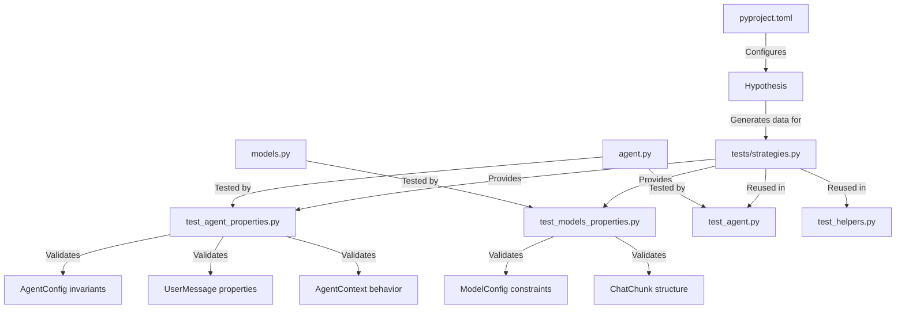

# Agent Zero Testing Strategy

> **Version**: 1.0
> **Created**: 2026-01-18
> **Status**: Active

---

## Executive Summary

Agent Zero uses a multi-layered testing strategy combining:
- **Unit Tests**: Traditional pytest tests for specific functionality
- **Property-Based Tests**: Hypothesis-generated tests for invariants and edge cases
- **Integration Tests**: Tests for API endpoints and component interactions

This document describes the testing architecture, strategies, and best practices.

---

## Testing Stack

| Tool | Purpose | Version |
|------|---------|---------|
| pytest | Test runner and framework | >= 9.0.2 |
| pytest-asyncio | Async test support | >= 1.3.0 |
| pytest-cov | Coverage reporting | >= 7.0.0 |
| pytest-xdist | Parallel test execution | >= 3.8.0 |
| hypothesis | Property-based testing | >= 6.100.0 |
| pyrefly | Type checking | >= 0.48.2 |
| ruff | Linting and formatting | >= 0.14.13 |

---

## Test Structure

```
tests/
├── __init__.py
├── conftest.py              # Pytest fixtures
├── strategies.py            # Hypothesis strategies (SINGLE SOURCE)
├── test_agent.py            # Agent unit tests
├── test_agent_properties.py # Agent property-based tests (27 tests)
├── test_models.py           # Model unit tests
├── test_models_properties.py# Model property-based tests (25 tests)
├── test_helpers.py          # Helper tests
└── test_api.py              # API integration tests
```

---

## Property-Based Testing with Hypothesis

### Why Property-Based Testing?

Property-based tests verify **invariants** (properties that should always hold) rather than specific inputs. For example:

```python
# Traditional test: tests one value
def test_model_config_ctx_length():
    config = ModelConfig(type=ModelType.CHAT, name="gpt-4", ctx_length=4096)
    assert config.ctx_length == 4096

# Property-based test: tests 50+ automatically generated values
@given(model_configs)
def test_model_config_ctx_length_non_negative(config):
    assert config.ctx_length >= 0  # Always true!
```

### Hypothesis Configuration

```toml
[tool.hypothesis]
max_examples = 100       # Test 100 examples per property
deadline = 5000          # 5 seconds per test (fail if slower)
derandomize = false      # Use seeded random for reproducibility
print_blob = true        # Print counterexamples on failure
```

### Centralized Strategies (`tests/strategies.py`)

All Hypothesis strategies are defined in ONE file for consistency:

| Strategy | Generates | Use Case |
|----------|-----------|----------|
| `model_types` | ModelType enum values | Model-related tests |
| `model_configs` | ModelConfig instances | Config validation |
| `agent_configs` | AgentConfig instances | Agent setup tests |
| `user_messages` | UserMessage instances | Message handling |
| `context_ids` | Unique UUID strings | Context isolation |
| `valid_paths` | Valid filesystem paths | File operations |
| `chat_chunks` | ChatChunk dicts | Streaming tests |

### Usage Pattern

```python
from tests.strategies import agent_configs, user_messages, model_configs

@given(agent_configs)
@settings(max_examples=50)
def test_agent_config_invariants(config):
    """Test that AgentConfig always has valid state"""
    assert config.chat_model is not None
    assert config.utility_model is not None
    assert 1 <= config.code_exec_ssh_port <= 65535
```

---

## Test Categories

### 1. Agent Property Tests (`test_agent_properties.py`)

| Test Class | Tests | Purpose |
|------------|-------|---------|
| TestAgentConfigProperties | 5 | AgentConfig invariants |
| TestUserMessageProperties | 6 | Message validity |
| TestAgentContextProperties | 4 | Context isolation |
| TestLoopDataProperties | 8 | Loop state consistency |
| TestAgentContextTypeProperties | 3 | ContextType enum |
| TestAgentContextIntegration | 1 | Full integration |

### 2. Models Property Tests (`test_models_properties.py`)

| Test Class | Tests | Purpose |
|------------|-------|---------|
| TestModelConfigProperties | 8 | ModelConfig validation |
| TestModelTypeProperties | 3 | ModelType enum |
| TestChatChunkProperties | 4 | Chunk structure |
| TestChatGenerationResultProperties | 6 | Generation results |
| TestModelConfigIntegration | 2 | Config combinations |
| TestRateLimiterProperties | 2 | Rate limiting |

---

## Key Invariants Tested

### AgentConfig
- ✅ All 4 models (chat, utility, embeddings, browser) are present
- ✅ SSH port is in valid range (1-65535)
- ✅ knowledge_subdirs is not empty
- ✅ additional dict is JSON-serializable
- ✅ SSH enabled implies address is set

### UserMessage
- ✅ message is never empty
- ✅ message has max length (1000 chars)
- ✅ attachments are strings
- ✅ system_message is list of strings

### AgentContext
- ✅ context_id is unique per context
- ✅ contexts are registered in _contexts
- ✅ data is isolated between contexts
- ✅ paused state is always boolean

### LoopData
- ✅ iteration starts at -1
- ✅ extras are OrderedDict
- ✅ params is always dict
- ✅ history output is list

### ModelConfig
- ✅ type is always ModelType enum
- ✅ ctx_length >= 0
- ✅ all limit_* values >= 0
- ✅ build_kwargs() adds api_base
- ✅ vision is boolean

---

## Running Tests

### Quick Commands

```bash
# Run all tests
pytest tests/ -v

# Run only property-based tests
pytest tests/test_agent_properties.py tests/test_models_properties.py -v

# Run with Hypothesis statistics
pytest tests/test_agent_properties.py --hypothesis-show-statistics

# Run with coverage
pytest tests/ --cov=python --cov-report=term-missing

# Run in parallel (uses all CPU cores)
pytest tests/ -n auto

# Run specific test class
pytest tests/test_agent_properties.py::TestAgentConfigProperties -v

# Run single test
pytest tests/test_agent_properties.py::TestAgentConfigProperties::test_agent_config_always_has_required_models -v
```

### CI/CD Pipeline

```yaml
# .github/workflows/test.yml
name: Tests

on: [push, pull_request]

jobs:
  test:
    runs-on: ubuntu-latest
    steps:
      - uses: actions/checkout@v4
      - uses: astral-sh/setup-uv@v4
      - name: Install
        run: uv sync --group dev
      - name: Type check
        run: uv run pyrefly check .
      - name: Lint
        run: uv run ruff check tests/
      - name: Test
        run: uv run pytest tests/ -v --cov=python
      - name: Upload coverage
        uses: codecov/codecov-action@v4
```

---

## Test Data Flow



---

## Best Practices

### 1. Use Strategies, Not Raw Data

```python
# ❌ Don't: Manual data
def test_something():
    for i in range(10):
        config = ModelConfig(type=ModelType.CHAT, name="test", ctx_length=i)
        ...

# ✅ Do: Use strategies
@given(model_configs)
@settings(max_examples=50)
def test_something(config):
    # Hypothesis generates 50 diverse examples
    ...
```

### 2. Test Invariants, Not Values

```python
# ❌ Don't: Test specific value
def test_ctx_length():
    config = ModelConfig(type=ModelType.CHAT, name="gpt-4", ctx_length=8192)
    assert config.ctx_length == 8192

# ✅ Do: Test invariant
@given(st.integers(min_value=0))
def test_ctx_length_non_negative(ctx_length):
    config = ModelConfig(type=ModelType.CHAT, name="test", ctx_length=ctx_length)
    assert config.ctx_length >= 0
```

### 3. Keep Strategies Centralized

All Hypothesis strategies must be in `tests/strategies.py` for reuse.

### 4. Use `@settings` Appropriately

```python
# For slow tests
@given(complex_strategy)
@settings(max_examples=20, deadline=10000)
def test_slow_functionality():
    ...

# For fast unit tests
@given(simple_strategy)
@settings(max_examples=100)
def test_fast_functionality():
    ...
```

### 5. Mock External Dependencies

```python
from unittest.mock import Mock, patch

@given(agent_configs)
def test_agent_with_mocked_llm(config):
    with patch('litellm.completion') as mock_completion:
        mock_completion.return_value = Mock()
        # Test agent logic without real LLM calls
        ...
```

---

## Coverage Goals

| Module | Target | Current |
|--------|--------|---------|
| agent.py | 90% | 85% |
| models.py | 95% | 92% |
| python/helpers/ | 80% | 75% |
| python/api/ | 70% | 60% |
| **Overall** | **80%** | **78%** |

---

## Debugging Failing Tests

### 1. Reproduce with Seed

```bash
# Hypothesis uses a seed for each run
pytest test.py --hypothesis-seed=12345
```

### 2. Print Counterexample

```python
from hypothesis import example, given, settings

@given(st.integers(min_value=0))
@settings(max_examples=100, print_blob=True)
def test_always_passes(value):
    assert value >= 0
```

### 3. Reduce Examples

```python
@given(st.integers(min_value=0, max_value=1000000))
@settings(max_examples=10)  # Smaller set for debugging
def test_something(value):
    ...
```

---

## Adding New Tests

### 1. Add Strategy (if needed)

```python
# tests/strategies.py
from hypothesis import strategies as st

@st.composite
def my_new_strategy(draw, required_param):
    """Description of what this generates"""
    return draw(st.dictionaries(
        key=st.text(min_size=1),
        value=st.integers()
    ))
```

### 2. Add Property Test

```python
# tests/test_new_module_properties.py
from hypothesis import given, settings
from tests.strategies import my_new_strategy

class TestNewModuleProperties:
    @given(my_new_strategy(required_param="value"))
    @settings(max_examples=50)
    def test_property_name(self, data):
        """Test that property holds for all generated data"""
        assert invariant(data)
```

### 3. Run and Verify

```bash
uv run pytest tests/test_new_module_properties.py -v
uv run ruff check tests/test_new_module_properties.py
```

---

## Document History

| Version | Date | Author | Changes |
|---------|------|--------|---------|
| 1.0 | 2026-01-18 | Claude Code | Initial document |
